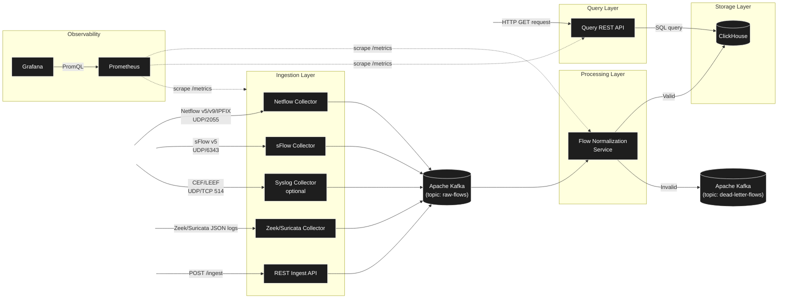
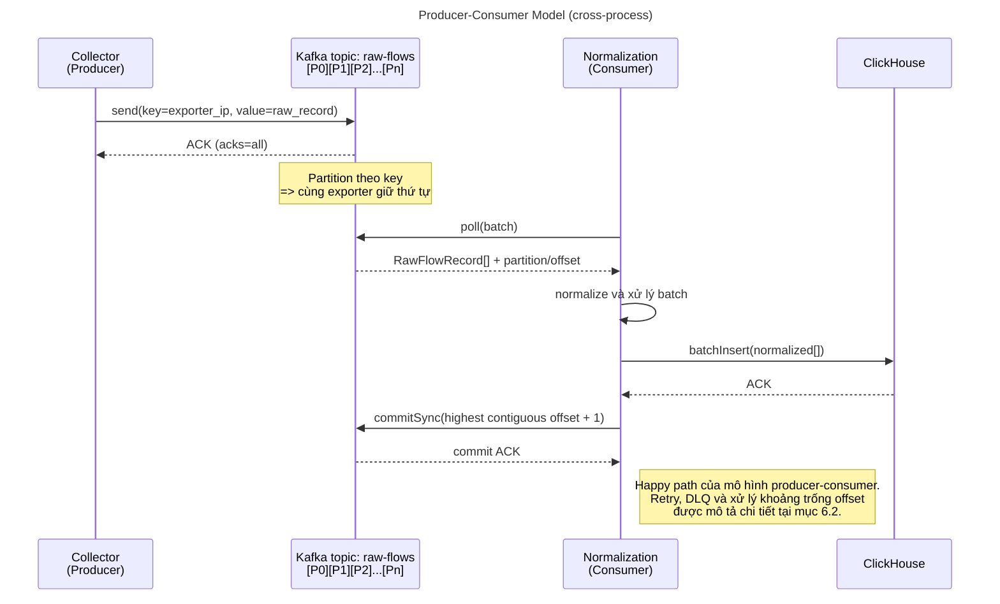
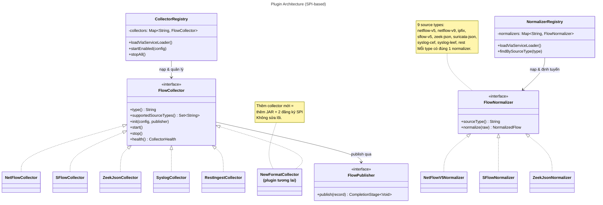
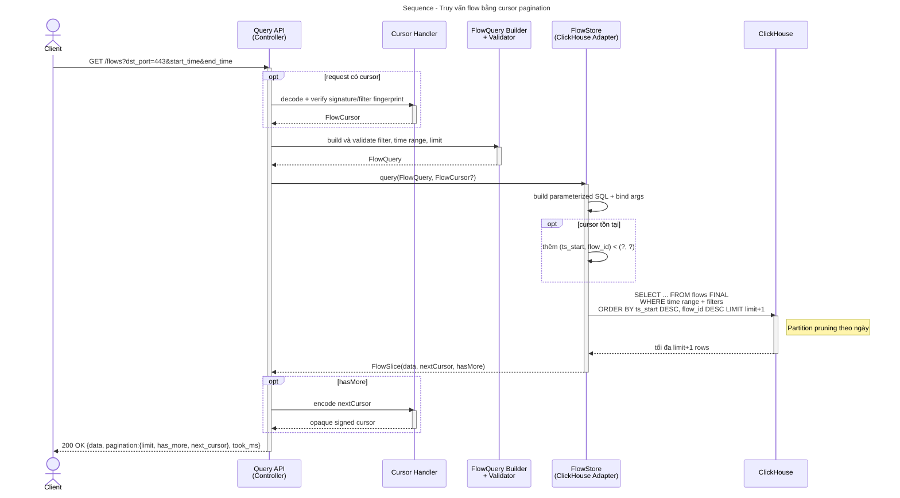
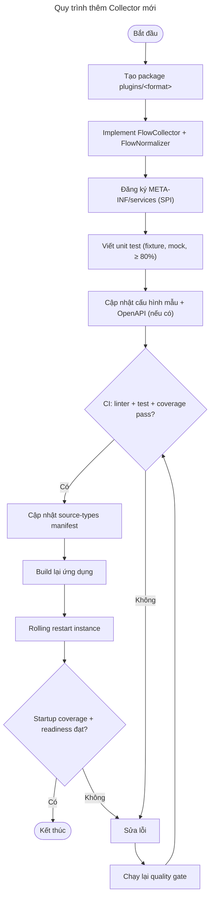
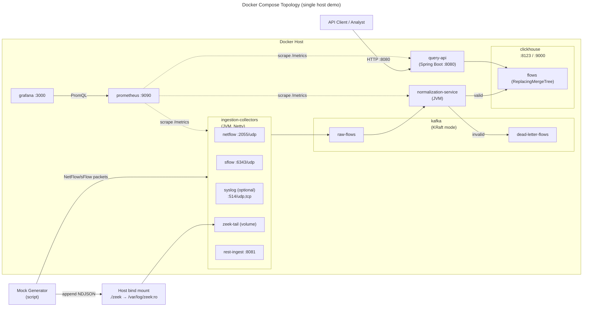

# **Tài liệu Thiết kế Phần mềm (Software Design Document \- SDD)**

## **Network Flow Collector & Query Service**

| Thuộc tính        | Giá trị                                |
|-------------------|----------------------------------------|
| **Tên dự án**     | Network Flow Collector & Query Service |
| **Mã tài liệu**   | SDD-NFC-001                            |
| **Phiên bản**     | 1.0                                    |
| **Trạng thái**    | Hoàn thiện (Final Draft)               |
| **Phân loại**     | Tài liệu thiết kế kỹ thuật nội bộ      |
| **Ngày cập nhật** | 2026-06-19                             |

---

# **1\. TỔNG QUAN**

## **1.1 Phạm vi (Scope)**

Tài liệu này mô tả thiết kế chi tiết của hệ thống **Network Flow Collector & Query Service** — một nền tảng backend đóng vai trò là **tầng thu thập (ingestion layer)** và **tầng truy vấn (query layer)** cho dữ liệu network flow log thu thập từ nhiều nguồn khác nhau trong hạ tầng mạng.

Phạm vi bao gồm:

| Trong phạm vi (In-scope)                                                                      | Ngoài phạm vi (Out-of-scope)                                   |
|-----------------------------------------------------------------------------------------------|----------------------------------------------------------------|
| Thu thập flow từ NetFlow v5/v9, IPFIX, sFlow, Zeek/Suricata JSON, Syslog (CEF/LEEF), REST API | Triển khai agent/probe trên thiết bị mạng (router, switch)     |
| Chuẩn hóa dữ liệu về một schema thống nhất (Normalized Flow Record)                           | Phân tích bảo mật chuyên sâu (threat detection, IDS/IPS logic) |
| Lưu trữ dữ liệu có phân vùng theo thời gian, tối ưu cho truy vấn IP                           | Giao diện người dùng (frontend dashboard)                      |
| REST API truy vấn: filter, aggregation (top talkers/ports), phân trang                        | Cơ chế alerting/notification thời gian thực                    |
| Đáp ứng các yêu cầu phi chức năng: hiệu năng, tin cậy, mở rộng, bảo mật, vận hành, bảo trì    | Cơ chế correlation đa sự kiện (SIEM correlation engine)        |
| Triển khai bằng Docker Compose và script sinh dữ liệu giả phục vụ demo                        | Triển khai production trên Kubernetes (chỉ nêu định hướng)     |

**Assumption:** Hệ thống được định vị là một **dịch vụ nền tảng (platform service)**, không phải sản phẩm SIEM hoàn chỉnh. Các tầng phân tích nâng cao (ML, anomaly detection) là khách hàng tiêu thụ (downstream consumer) của API mà hệ thống này cung cấp.

**Trade-off độ tin cậy được chấp nhận:** Yêu cầu lưu offset/position để khởi động lại không mất dữ liệu chỉ có thể bảo đảm với nguồn có khả năng replay hoặc backpressure như Kafka, file tail, TCP và REST. NetFlow, sFlow và Syslog chạy qua UDP không có ACK/offset nên đầu vào trước khi Kafka xác nhận là **best-effort**; datagram có thể mất khi tiến trình dừng, socket/queue đầy hoặc mạng làm rơi gói. Hệ thống giảm thiểu và phát hiện mất dữ liệu bằng bounded queue, sequence number và metric drop, nhưng không tuyên bố at-least-once cho đoạn UDP → collector.

## **1.2 Mục đích (Purpose)**

Mục đích của tài liệu là cung cấp một bản thiết kế đủ chi tiết để:

1. **Đội phát triển** có thể hiện thực (implement) hệ thống trực tiếp từ tài liệu mà không cần làm rõ thêm các quyết định kiến trúc cốt lõi.  
2. **Đội vận hành (DevOps/SRE)** hiểu được mô hình triển khai, các điểm giám sát và yêu cầu hạ tầng.  
3. **Người đánh giá kỹ thuật (reviewer)** có thể truy vết từng quyết định thiết kế về lý do và yêu cầu gốc.  
4. Làm cơ sở để **mở rộng** (thêm collector mới) mà không phá vỡ kiến trúc hiện có.

Tài liệu trả lời ba câu hỏi cốt lõi: hệ thống gồm những thành phần gì (What), chúng tương tác ra sao (How), và **tại sao** lại chọn cách thiết kế đó (Why).

## **1.3 Đối tượng sử dụng (Audience)**

| Đối tượng                        | Mục tiêu đọc tài liệu                            | Chương trọng tâm |
|----------------------------------|--------------------------------------------------|------------------|
| Backend Developer                | Hiện thực collector, normalization, storage, API | 3, 4, 5          |
| DevOps / SRE                     | Triển khai, giám sát, vận hành                   | 6.5, 7           |
| QA Engineer                      | Xây dựng chiến lược test                         | 6.6.1, 5.2       |
| Technical Lead / Architect       | Đánh giá quyết định thiết kế                     | 3, 6             |
| Người đóng góp mới (Contributor) | Thêm collector format mới                        | 3.3, 6.6.3       |

## **1.4 Sự tuân thủ (Compliance)**

Thiết kế tuân thủ các chuẩn và quy ước sau:

| Chuẩn / Quy ước                  | Áp dụng cho                              |
|----------------------------------|------------------------------------------|
| **RFC 3954**                     | Cấu trúc gói NetFlow v9 (template-based) |
| **RFC 7011 (IPFIX)**             | Cấu trúc IPFIX, kế thừa từ NetFlow v9    |
| **Cisco NetFlow v5 spec**        | Cấu trúc gói nhị phân v5 cố định         |
| **RFC 5424**                     | Định dạng Syslog message                 |
| **ArcSight CEF & IBM LEEF spec** | Parse header và extension key-value      |
| **OpenAPI 3.0 (Swagger)**        | Tài liệu hóa REST API                    |
| **Semantic Versioning 2.0.0**    | Đánh phiên bản API và artifact           |
| **ISO 8601 / RFC 3339**          | Biểu diễn timestamp (UTC)                |
| **12-Factor App**                | Quản lý cấu hình, log, dependency        |

**Assumption:** Hệ thống xử lý metadata phiên kết nối (flow metadata), không bắt buộc tuân thủ các quy định bảo vệ dữ liệu cá nhân ở mức payload. Tuy nhiên, thiết kế vẫn cung cấp cơ chế **masking** cho các trường nhạy cảm (mục 6.4) để sẵn sàng cho yêu cầu tuân thủ trong tương lai.

---

# **2\. ĐỊNH NGHĨA**

## **2.1 Thuật ngữ chung**

| Thuật ngữ               | Định nghĩa                                                                                                                             |
|-------------------------|----------------------------------------------------------------------------------------------------------------------------------------|
| **Flow (Network Flow)** | Một chuỗi gói tin có chung 5 thuộc tính định danh (5-tuple): src IP, dst IP, src port, dst port, protocol, trong một khoảng thời gian. |
| **Flow Record**         | Bản ghi tóm tắt một flow: thời gian, số byte, số gói, cờ TCP, v.v.                                                                     |
| **5-tuple**             | Bộ 5 trường định danh duy nhất một flow.                                                                                               |
| **Ingestion**           | Quá trình thu nhận dữ liệu thô từ nguồn vào hệ thống.                                                                                  |
| **Normalization**       | Quá trình chuyển dữ liệu từ các định dạng khác nhau về một schema thống nhất.                                                          |
| **Collector**           | Thành phần phần mềm nhận và parse một định dạng flow cụ thể.                                                                           |
| **Exporter**            | Thiết bị/phần mềm gửi flow record đi (router, probe, agent).                                                                           |
| **EPS**                 | Events Per Second — số bản ghi xử lý mỗi giây.                                                                                         |
| **At-least-once**       | Đảm bảo mỗi bản ghi được xử lý **tối thiểu một lần** (chấp nhận trùng lặp, không chấp nhận mất).                                       |
| **Offset**              | Vị trí đọc hiện tại trong một luồng dữ liệu, dùng để khôi phục sau khi restart.                                                        |

## **2.2 Thuật ngữ mạng**

| Thuật ngữ      | Định nghĩa                                                                                                                                                                  |
|----------------|-----------------------------------------------------------------------------------------------------------------------------------------------------------------------------|
| **NetFlow v5** | Giao thức xuất flow của Cisco với **cấu trúc nhị phân cố định**: header 24 byte \+ các record 48 byte. Không hỗ trợ template, dễ parse nhưng kém linh hoạt.                 |
| **NetFlow v9** | Phiên bản template-based (RFC 3954). Gói gồm **Template FlowSet** (định nghĩa cấu trúc) và **Data FlowSet** (dữ liệu thực). Bộ thu phải **cache template** để giải mã data. |
| **IPFIX**      | IP Flow Information Export (RFC 7011\) — chuẩn IETF mở rộng từ NetFlow v9, hỗ trợ Enterprise-specific fields và Variable-Length encoding.                                   |
| **sFlow**      | Cơ chế lấy mẫu (sampling) gói tin, khác bản chất với NetFlow (NetFlow là aggregation theo flow).                                                                            |
| **Zeek (Bro)** | Network security monitor sinh log dạng văn bản/JSON; conn.log chứa thông tin flow.                                                                                          |
| **Suricata**   | IDS/IPS sinh eve.json — log JSON theo dòng (NDJSON), bao gồm sự kiện flow và netflow.                                                                                       |
| **Syslog**     | Giao thức truyền log (RFC 5424\) qua UDP/TCP, port 514\.                                                                                                                    |
| **CEF**        | Common Event Format (ArcSight): CEF:Version                                                                                                                                 |Vendor|Product|...|Extension. |
| **LEEF**       | Log Event Extended Format (IBM QRadar): tương tự CEF nhưng phân tách bằng tab.                                                                                              |
| **UDP**        | Giao thức không kết nối, không đảm bảo thứ tự/độ tin cậy. NetFlow & Syslog thường dùng UDP.                                                                                 |
| **TCP**        | Giao thức có kết nối, đảm bảo thứ tự. Dùng cho Syslog tin cậy và một số stream log.                                                                                         |

## **2.3 Thuật ngữ kiến trúc**

| Thuật ngữ                | Định nghĩa                                                                                                                                                        |
|--------------------------|-------------------------------------------------------------------------------------------------------------------------------------------------------------------|
| **Producer-Consumer**    | Mẫu kiến trúc tách rời bên sinh dữ liệu (producer) và bên xử lý (consumer) qua một hàng đợi trung gian.                                                           |
| **Message Bus / Broker** | Hệ thống trung gian lưu trữ và truyền message (ở đây là Apache Kafka).                                                                                            |
| **Backpressure**         | Cơ chế kiểm soát luồng khi consumer xử lý chậm hơn producer.                                                                                                      |
| **Plugin Architecture**  | Kiến trúc cho phép nạp thêm collector qua interface chung mà không sửa lõi.                                                                              |
| **SPI**                  | Service Provider Interface — cơ chế của Java (ServiceLoader) để khám phá implementation lúc runtime.                                                              |
| **Columnar Storage**     | Lưu trữ theo cột, tối ưu cho truy vấn phân tích (OLAP) và nén dữ liệu.                                                                                            |
| **Materialized View**    | Khung nhìn được tính toán sẵn và lưu vật lý. Incremental view tăng tốc aggregation nhưng không tự sửa phần đã cộng từ bản ghi replay khi bảng nguồn dedup về sau. |
| **Idempotency**          | Tính chất một thao tác lặp lại nhiều lần cho cùng kết quả (chống trùng lặp).                                                                                      |
| **Sidecar**              | Container phụ chạy cùng container chính để cung cấp chức năng bổ trợ (vd: log shipping).                                                                          |
| **Virtual Thread**       | Luồng nhẹ của JVM (Project Loom, Java 21\) cho phép xử lý đồng thời số lượng lớn với chi phí thấp.                                                                |

---

# **3\. KIẾN TRÚC HỆ THỐNG VÀ QUYẾT ĐỊNH THIẾT KẾ**

## **3.1 Sơ đồ khối kiến trúc tổng thể (High-level Architecture)**

Hệ thống được tổ chức thành **bốn tầng (layer)** rõ ràng, liên kết qua một **message bus (Apache Kafka)** đóng vai trò bộ đệm phi đồng bộ:

1. **Ingestion Layer** — tập hợp các collector parse từng định dạng và đẩy bản ghi thô lên Kafka.  
2. **Processing Layer** — Flow Normalization Service tiêu thụ bản ghi thô, chuẩn hóa về schema thống nhất.  
3. **Storage Layer** — ClickHouse lưu trữ flow đã chuẩn hóa, phân vùng theo thời gian.  
4. **Query Layer** — REST API phục vụ filter, aggregation và phân trang.

Tầng giám sát (Observability) chạy xuyên suốt và thu thập metrics từ mọi thành phần. Mỗi dịch vụ vẫn tự xuất application log dạng JSON có cấu trúc theo yêu cầu vận hành; phiên bản 1.0 không bao gồm hệ thống thu gom hoặc lưu trữ log tập trung.


**Luồng dữ liệu chính:** Nguồn → Collector (parse) → raw-flows topic → Normalization (chuẩn hóa, validate) → batch insert vào ClickHouse → Query API đọc ra. Bản ghi lỗi được đẩy sang **Dead Letter Queue (DLQ)** để điều tra mà không chặn pipeline.

**Lý do thiết kế:** Tách bốn tầng giúp mỗi tầng **co giãn độc lập** (scale theo nhu cầu riêng), **thay thế công nghệ** ở một tầng mà không ảnh hưởng tầng khác, và **cách ly lỗi** (collector chết không làm sập query). Kafka ở giữa là then chốt để đáp ứng yêu cầu *at-least-once* và *offset tracking* (mục 6.2).

## **3.2 Mô hình Producer \- Consumer**

Yêu cầu nêu rõ pipeline ingestion theo mô hình **producer-consumer**. Hệ thống hiện thực mô hình này ở hai cấp độ:

### **3.2.1 Cấp độ nội bộ collector (in-process)**

Mỗi collector dùng mô hình producer-consumer nội bộ để tách **I/O nhận gói** khỏi **parse \+ publish**:

* **Producer (I/O thread):** Netty event-loop chỉ nhận gói tin và đặt ByteBuf vào một hàng đợi giới hạn (bounded queue / Disruptor ring buffer). Mục tiêu: không bao giờ block event-loop để tránh mất gói UDP.  
* **Consumer (worker pool):** Các virtual thread lấy gói ra, parse, và publish lên Kafka.

### **3.2.2 Cấp độ hệ thống (cross-process, qua Kafka)**

| Vai trò      | Thành phần            | Cơ chế                                                              |
|--------------|-----------------------|---------------------------------------------------------------------|
| **Producer** | Các collector         | Kafka Producer API, ghi vào topic raw-flows với key \= exporter\_ip |
| **Broker**   | Apache Kafka          | Phân vùng (partition) theo key, lưu bền vững (durable), replication |
| **Consumer** | Normalization Service | Kafka Consumer Group, commit offset sau khi xử lý thành công        |

**Lý do thiết kế:**

* **Decoupling:** Collector không cần biết đến storage; khi storage bảo trì, dữ liệu vẫn được giữ trong Kafka.  
* **Buffering & Backpressure:** Khi tải tăng đột biến (burst), Kafka hấp thụ; consumer xử lý theo tốc độ của mình. Đây là điều kiện then chốt để đạt 5.000 EPS ổn định và không mất các bản ghi đã được Kafka xác nhận; đầu vào UDP trước Kafka vẫn là best-effort như mục 6.2.1.  
* **Partition theo exporter\_ip:** Đảm bảo thứ tự của các flow từ cùng một exporter, đồng thời cho phép song song hóa giữa các exporter khác nhau (mục 6.3).

**Assumption:** Kafka được chọn thay vì hàng đợi in-memory hay RabbitMQ vì: 
1. Khả năng lưu trữ bền vững \+ replay theo offset là theo yêu cầu ("restart không mất dữ liệu") 
2. Throughput cao phù hợp yêu cầu về hiệu năng 5.000+ EPS
3. Mô hình consumer group hỗ trợ scale ngang tự nhiên.

## **3.3 Kiến trúc Plugin cho Collector**

Theo yêu cầu phi chức năng: *"Kiến trúc plugin-based cho collector — thêm format mới không ảnh hưởng collector đang chạy"*. Đây là quyết định kiến trúc trọng tâm để đảm bảo **khả năng mở rộng** và **bảo trì**.

### **3.3.1 Hợp đồng plugin (Plugin Contract)**

Mọi collector đều hiện thực một interface chung. Lõi hệ thống chỉ phụ thuộc vào interface này, không phụ thuộc vào implementation cụ thể (nguyên tắc **Dependency Inversion**).

public interface FlowCollector {  
    /\*\* Định danh duy nhất của plugin, vd: "netflow", "sflow", "zeek-json". \*/  
    String type();

    /\*\* Các sourceType mà plugin có thể phát ra, vd: netflow-v5/netflow-v9/ipfix. \*/  
    Set\<String\> supportedSourceTypes();

    /\*\* Khởi tạo từ cấu hình (port, đường dẫn file, ...). \*/  
    void init(CollectorConfig config, FlowPublisher publisher);

    /\*\* Bắt đầu nhận dữ liệu (mở socket/đọc file). Phải trả về sau khi listener đã khởi chạy. \*/  
    void start();

    /\*\* Dừng an toàn, chờ các tác vụ/publish còn dở trong giới hạn timeout. \*/  
    void stop();

    /\*\* Snapshot trạng thái phục vụ /health; không gây I/O chậm và không có side effect. \*/  
    CollectorHealth health();  
}

/\*\* Collector chỉ biết publish RawFlowRecord, không phụ thuộc Kafka API. \*/  
public interface FlowPublisher {  
    CompletionStage\<Void\> publish(RawFlowRecord record);  
}

public enum CollectorStatus { STARTING, UP, DEGRADED, DOWN, STOPPED }

public record CollectorHealth(  
    CollectorStatus status,
    String message,
    Instant checkedAt,
    Instant lastRecordAt
) {}

`type()` định danh **plugin/instance cấu hình**, còn `RawFlowRecord.sourceType` định danh **định dạng bản ghi**. Ví dụ một plugin có `type() = "netflow"` có thể công bố ba source type: `netflow-v5`, `netflow-v9`, `ipfix`. Mỗi giá trị `sourceType` phải có đúng một `FlowNormalizer` tương ứng.

#### **Quy ước tên giữa các lớp**

Java dùng **camelCase** cho identifier trong mã nguồn; JSON/Kafka payload, ClickHouse và Prometheus dùng **snake_case**.

| Ngữ cảnh             | Tên            | Ví dụ                         |
|----------------------|----------------|-------------------------------|
| Java record/property | `sourceType`   | `raw.sourceType()`            |
| Java SPI method      | `sourceType()` | `normalizer.sourceType()`     |
| JSON/Kafka key       | `source_type`  | `"source_type": "netflow-v9"` |
| ClickHouse column    | `source_type`  | `flows.source_type`           |
| Prometheus label     | `source_type`  | `source_type="netflow-v9"`    |

Quy tắc này áp dụng tương tự cho các cặp như `receivedAt` ↔ `received_at`, `tsStart` ↔ `ts_start` và `flowId` ↔ `flow_id`. Tài liệu dùng camelCase khi nói về Java API và snake_case khi nói về wire format, storage hoặc metric label. Serializer/deserializer phải cấu hình mapping tường minh hoặc dùng một naming strategy được khóa bằng contract test.

#### **Quy ước định danh và cấu hình**

* `type()` và `supportedSourceTypes()` phải ổn định trong suốt vòng đời plugin, viết thường theo dạng kebab-case (`[a-z0-9]+(-[a-z0-9]+)*`).  
* Hai plugin không được trùng `type`; hai normalizer không được trùng `sourceType`. `CollectorRegistry` phải **fail fast** khi phát hiện trùng thay vì ghi đè âm thầm.  
* Cấu hình collector được đặt dưới namespace theo `type`, có tối thiểu trường `enabled`; phần còn lại do plugin bind và validate. Plugin được bật nhưng thiếu/sai cấu hình chuyển sang `DOWN`, ghi rõ nguyên nhân và không ngăn registry thử khởi động các plugin khác.  
* Phiên bản 1.x build và phát hành `collector-spi` cùng các plugin trong một repository. Không thực hiện thương lượng phiên bản lúc runtime; JAR không tương thích SPI phải làm startup validation thất bại với thông báo rõ ràng.

Ví dụ:

```yaml
collectors:
  netflow:
    enabled: true
    bind-address: 0.0.0.0
    port: 2055
    queue-capacity: 10000
  zeek-json:
    enabled: false
    path: /var/log/zeek/conn.log
```

#### **Vòng đời bắt buộc**

```text
discovered -> init -> STARTING -> start -> UP/DEGRADED -> stop -> STOPPED
                     \                         |
                      +------ failure -> DOWN--+
```

* Registry gọi `init()` và `start()` **đúng một lần**, theo thứ tự trên và không gọi đồng thời. Gọi sai thứ tự là lỗi lập trình (`IllegalStateException`).  
* `init()` chỉ bind/validate cấu hình và chuẩn bị tài nguyên; chưa nhận dữ liệu. Nếu `init()` thất bại, plugin ở trạng thái `DOWN` và không được gọi `start()`.  
* `start()` mở listener/worker nhưng không được giữ thread gọi hàm. Lỗi khởi động được registry bắt, ghi log/metric và đánh dấu riêng plugin đó là `DOWN`; các plugin khác tiếp tục khởi động.  
* `stop()` ngừng nhận dữ liệu mới, drain hàng đợi nội bộ, chờ các `CompletionStage` publish đang còn dở rồi giải phóng socket/file/thread. `stop()` phải idempotent và mặc định kết thúc trong `shutdown-timeout=30s`; quá hạn thì hủy phần còn lại, ghi số bản ghi chưa xử lý và chuyển `DOWN`.  
* Lõi đóng `FlowPublisher` dùng chung chỉ sau khi đã gọi `stop()` cho tất cả collector. `health()` có thể được gọi đồng thời khi plugin đang chạy hoặc dừng nên phải thread-safe; nó không được ném exception ra ngoài registry.

#### **Ngữ nghĩa publish, lỗi và backpressure**

`FlowPublisher.publish()` là bất đồng bộ. Hàm trả về ngay một `CompletionStage`: stage hoàn thành thành công **sau khi Kafka broker xác nhận theo `acks=all`**, hoặc hoàn thành exceptionally sau khi publisher đã dùng hết chính sách retry ở mục 6.2.3. `FlowPublisher` chịu trách nhiệm serialize, retry và metric Kafka; collector phải quan sát kết quả stage để cập nhật `health`, không được bỏ qua lỗi. Nếu số publish đang chờ đã đạt giới hạn, publisher trả về failed stage với `PublishBackpressureException`; collector xử lý theo loại nguồn trong bảng dưới, không tạo thêm hàng đợi không giới hạn.

Để tránh tăng bộ nhớ vô hạn, cả hàng đợi parse và số publish đang chờ xác nhận đều có giới hạn cấu hình:

| Loại nguồn                     | Khi hàng đợi đầy                     | Hành vi bắt buộc                                                                                                            |
|--------------------------------|--------------------------------------|-----------------------------------------------------------------------------------------------------------------------------|
| UDP (NetFlow/sFlow/Syslog UDP) | Không thể yêu cầu nguồn gửi chậm lại | Drop datagram mới, tăng `nfc_ingest_dropped_total{source_type,reason="queue_full"}` và chuyển `DEGRADED` trong khi còn drop |
| File tail                      | Có thể tạm dừng                      | Tạm ngừng đọc; chỉ cập nhật checkpoint sau khi publish thành công                                                           |
| TCP/Unix socket                | Có backpressure transport            | Tạm ngừng read/giảm demand cho đến khi queue có chỗ                                                                         |
| REST ingest                    | Có thể phản hồi client               | Trả `429 Too Many Requests` (quá tải có kiểm soát) hoặc `503 Service Unavailable` (publisher/Kafka không sẵn sàng)          |

Mọi parser phải fail-safe theo mục 3.4.4: lỗi một gói/dòng chỉ tăng metric và xử lý bản ghi lỗi theo chính sách nguồn, không được làm chết worker loop. Lỗi vòng đời (`init/start/stop`) được registry cách ly bằng `try/catch`; tuy nhiên vì các plugin vẫn chạy chung JVM, thiết kế này không cách ly tuyệt đối lỗi cạn bộ nhớ, CPU hoặc lỗi tiến trình.

#### **Ý nghĩa trạng thái health**

| Trạng thái | Ý nghĩa                                                                                                            |
|------------|--------------------------------------------------------------------------------------------------------------------|
| `STARTING` | Đã init, listener/worker đang khởi động                                                                            |
| `UP`       | Listener hoạt động; lần publish gần nhất (nếu đã có dữ liệu) thành công và không có lỗi/drop trong cửa sổ theo dõi |
| `DEGRADED` | Vẫn nhận dữ liệu nhưng đang có drop, parse/publish lỗi vượt ngưỡng hoặc phụ thuộc chập chờn                        |
| `DOWN`     | Không thể init/start, listener đã chết hoặc publisher không khả dụng sau retry                                     |
| `STOPPED`  | Đã dừng chủ động và giải phóng tài nguyên                                                                          |

Trong collector service, `/health/ready` trả `DOWN` nếu Kafka không sẵn sàng hoặc có bất kỳ collector `enabled=true` nào ở trạng thái `DOWN`; `DEGRADED` vẫn được coi là ready nhưng phải xuất cảnh báo và metric. Collector chuyển `DEGRADED` khi có drop hoặc lỗi parse/publish trong cửa sổ mặc định 60 giây, và trở lại `UP` sau một cửa sổ hoàn toàn không có lỗi. Các ngưỡng này có thể cấu hình để tránh trạng thái dao động theo từng bản ghi.

### **3.3.2 Cơ chế khám phá (Discovery) — Java SPI**

Sử dụng `java.util.ServiceLoader` cho cả collector và normalizer. Mỗi plugin đăng ký implementation trong hai file tương ứng:

```text
META-INF/services/com.kien.networkflowcollector.spi.FlowCollector
META-INF/services/com.kien.networkflowcollector.spi.FlowNormalizer
```

Mỗi dòng trong file là fully-qualified class name của một implementation. Collector service chỉ nạp `FlowCollector` và kiểm tra định danh, cấu hình cùng lifecycle của collector; nó **không** kiểm tra sự hiện diện của normalizer trên classpath của service khác. Artifact plugin phải có trên classpath của collector service để nạp `FlowCollector` và trên classpath của normalization service để nạp `FlowNormalizer`.

Coverage giữa collector và normalizer được kiểm tra ở hai lớp:

1. **CI/build-time:** plugin contract test khám phá toàn bộ `FlowCollector` và `FlowNormalizer` trong repository, yêu cầu mỗi giá trị thuộc `supportedSourceTypes()` có đúng một normalizer và tạo manifest `META-INF/nfc/source-types.json` đóng gói trong normalization artifact của cùng release. Build thất bại nếu coverage thiếu hoặc định danh trùng.  
2. **Normalization-service startup:** service so sánh tập source type trong `META-INF/nfc/source-types.json` với các `FlowNormalizer` thực sự nạp được. Nếu thiếu, pipeline **fail closed**: tiến trình vẫn phục vụ `/health/live` và `/metrics`, readiness `DOWN`, Kafka consumer chưa được khởi động, startup log liệt kê các source type thiếu và gauge `nfc_normalizer_coverage_missing` phản ánh số lượng thiếu. Nhờ tiến trình vẫn sống, Prometheus có thể scrape gauge trong thời gian deployment chưa sẵn sàng.



### **3.3.3 Tại sao chọn SPI thay vì cấu hình tĩnh?**

| Tiêu chí                    | SPI / ServiceLoader                                                                           | If-else / Factory cứng       |
|-----------------------------|-----------------------------------------------------------------------------------------------|------------------------------|
| Thêm format mới             | Chỉ thêm package/provider mới, không sửa lõi (Open/Closed)                                    | Phải sửa code lõi, build lại |
| Cách ly lỗi vòng đời/parser | Registry bắt lỗi theo plugin; các plugin khác tiếp tục chạy. Không cách ly lỗi tài nguyên/JVM | Rủi ro chạm code chung       |
| Bật/tắt collector           | Theo config \+ classpath                                                                      | Cần điều kiện trong code     |
| Phù hợp yêu cầu mở rộng     | Không sửa implementation hiện hữu; cần restart/rolling restart để nạp JAR                     | Phải sửa và build lại lõi    |

**Assumption:** Plugin được nạp lúc khởi động (static SPI), không hỗ trợ hot-reload runtime ở phiên bản 1.0. Thêm JAR không yêu cầu sửa hay build lại module hiện hữu nhưng **phải restart collector/normalization service** để nạp provider mới. Nếu yêu cầu không gián đoạn, chạy từ hai instance và rolling restart từng instance; một instance đơn lẻ sẽ có downtime trong lúc restart. Hot-reload bằng OSGi/PF4J chỉ xem xét khi dự án thực sự phát sinh nhu cầu, tránh tăng độ phức tạp không cần thiết cho dự án cá nhân.

## **3.4 Quyết định thiết kế (Design Decisions)**

### **3.4.1 Vì sao chọn Java 21**

| Lý do                              | Giải thích                                                                                                                |
|------------------------------------|---------------------------------------------------------------------------------------------------------------------------|
| **Virtual Threads (Project Loom)** | Cho phép xử lý hàng chục nghìn kết nối/tác vụ I/O đồng thời với chi phí bộ nhớ thấp — lý tưởng cho ingestion nhiều nguồn. |
| **LTS**                            | Bản hỗ trợ dài hạn, ổn định cho production.                                                                               |
| **Hiệu năng GC**                   | ZGC/G1 độ trễ thấp, phù hợp pipeline thông lượng cao.                                                                     |
| **Pattern Matching, Records**      | Mã parse/DTO ngắn gọn, ít lỗi (record cho RawFlowRecord, NormalizedFlow).                                                 |
| **Hệ sinh thái**                   | Netty, Kafka client, Spring Boot, ClickHouse JDBC đều trưởng thành trên JVM.                                              |

### **3.4.2 Vì sao chọn Netty cho tầng nhận gói**

| Lý do                   | Giải thích                                                                                       |
|-------------------------|--------------------------------------------------------------------------------------------------|
| **NIO hiệu năng cao**   | Event-loop không block, xử lý lượng lớn datagram UDP — quan trọng vì UDP mất gói nếu xử lý chậm. |
| **ByteBuf zero-copy**   | Parse gói nhị phân NetFlow theo offset mà không copy thừa bộ nhớ.                                |
| **Hỗ trợ cả UDP & TCP** | Một framework cho NetFlow (UDP) và Syslog (UDP/TCP).                                             |
| **Pipeline handler**    | Tách decoder/parser thành các handler tái sử dụng được.                                          |

### **3.4.3 Vì sao chọn ClickHouse làm Storage**

So sánh các lựa chọn cho khối lượng dữ liệu phân tích lớn, ghi nhiều, truy vấn aggregation:

| Tiêu chí                               | ClickHouse (chọn)                                                                                  | PostgreSQL \+ TimescaleDB                                  | Elasticsearch                                                                  |
|----------------------------------------|----------------------------------------------------------------------------------------------------|------------------------------------------------------------|--------------------------------------------------------------------------------|
| Mô hình lưu trữ                        | Columnar (OLAP)                                                                                    | Row \+ hypertable                                          | Inverted index                                                                 |
| Tốc độ aggregation (top talkers/ports) | Nhanh                                                                                              | Trung bình–khá                                             | Khá                                                                            |
| Tỷ lệ nén                              | Cao                                                                                                | Trung bình                                                 | Thấp–trung bình                                                                |
| Ghi 5.000+ EPS (batch)                 | Đáp ứng được, tối ưu cho batch insert append-only, throughput cao và dễ mở rộng khi lưu lượng tăng | Đáp ứng được, nhưng chịu chi phí WAL, index và transaction | Đáp ứng được, nhưng tốn tài nguyên cho refresh, segment merge và quản lý shard |
| Phân vùng theo thời gian               | PARTITION BY toYYYYMMDD(ts_start)                                                                  | Tự động qua hypertable                                     | Index theo ngày                                                                |
| Chi phí vận hành                       | Thấp–trung bình                                                                                    | Thấp                                                       | Cao (JVM heap)                                                                 |
| Phù hợp truy vấn \< 2s/10M bản ghi     | Được                                                                                               | Được                                                       | Tùy mapping                                                                    |

**Kết luận:** ClickHouse phù hợp nhất vì bài toán bản chất là **OLAP trên dữ liệu time-series** — ghi nhiều, ít cập nhật, truy vấn lọc \+ tổng hợp theo cột (IP, port, thời gian).

**Assumption:** Nếu tổ chức ưu tiên đơn giản hóa stack và đã có sẵn PostgreSQL, **TimescaleDB** là phương án thay thế hợp lệ; thiết kế Storage Layer (mục 4.3) được trừu tượng qua interface FlowStore để có thể đổi backend mà không sửa Query API.

### **3.4.4 Cơ chế parse cho từng định dạng**

| Định dạng              | Cơ chế parse                                                                                                      | Lý do                                                                                           |
|------------------------|-------------------------------------------------------------------------------------------------------------------|-------------------------------------------------------------------------------------------------|
| **NetFlow v5**         | Đọc offset nhị phân cố định trên `ByteBuf` (header 24 B \+ mỗi record 48 B)                                       | Cấu trúc tĩnh; parse trực tiếp có chi phí thấp và không cần tạo object trung gian               |
| **NetFlow v9 / IPFIX** | Parser template-based \+ **TemplateCache** theo `(protocol, exporter, observationDomain/sourceId, templateId)`    | Data Set chỉ giải mã được khi collector đã nhận đúng template của Exporting Process             |
| **sFlow v5**           | Parse datagram theo sample format; trong mỗi sample tiếp tục parse các flow/counter record theo enterprise/format | sFlow là dữ liệu lấy mẫu và có thể mở rộng kiểu record; phải giữ metadata sampling              |
| **Zeek/Suricata JSON** | Jackson **streaming** theo từng dòng NDJSON, sau đó chuyển qua adapter schema riêng cho Zeek và Suricata          | Không nạp toàn file vào RAM và không trộn hai schema nguồn khác nhau                            |
| **Syslog CEF/LEEF**    | Tách Syslog envelope, header và extension bằng state machine theo delimiter/escape; không dùng một regex bao trùm | CEF/LEEF có cấu trúc rõ nhưng delimiter có thể được escape và giá trị extension có khoảng trắng |
| **REST ingest**        | Jackson data binding qua Spring `@RequestBody` \+ Bean Validation                                                 | Payload có schema do API kiểm soát; ưu tiên thông báo lỗi trường cụ thể cho client              |

Chi tiết pipeline, quy tắc kiểm tra dữ liệu, xử lý lỗi và cách tạo `RawFlowRecord` của từng collector được trình bày tại mục 4.1.

---

# **4\. THIẾT KẾ THÀNH PHẦN**

```plantuml
@startuml
title Component Diagram - Thiết kế thành phần nội bộ
skinparam componentStyle uml2
skinparam packageStyle rectangle

interface "FlowCollector SPI" as FlowCollector
interface "FlowPublisher" as FlowPublisher
interface "FlowNormalizer SPI" as FlowNormalizer
interface "FlowStore API" as FlowStore
interface "Query REST API" as QueryApi
interface "Ingest REST API" as IngestApi

package "Ingestion Layer" {
    component "CollectorRegistry" as CollectorRegistry <<registry>>
    component "NetFlow Collector" as NetFlowCollector <<plugin>>
    component "sFlow Collector" as SFlowCollector <<plugin>>
    component "Zeek/Suricata Collector" as ZeekCollector <<plugin>>
    component "Syslog Collector" as SyslogCollector <<plugin>>
    component "REST Ingest Collector" as RestIngestCollector <<plugin>>
    component "KafkaFlowPublisher" as KafkaFlowPublisher <<adapter>>
}

package "Normalization Service" {
    component "KafkaFlowConsumer" as KafkaFlowConsumer <<adapter>>
    component "NormalizerRegistry" as NormalizerRegistry <<registry>>
    component "Source Normalizers" as SourceNormalizers <<strategy>>
    component "Validation Rules" as ValidationRules <<policy>>
    component "Enrichment Provider" as EnrichmentProvider <<optional-adapter>>
    component "Masking Engine" as MaskingEngine <<policy>>
    component "Batch Writer" as BatchWriter <<service>>
    component "DLQ Producer" as DlqProducer <<kafka-producer>>
}

package "Storage Layer" {
    component "ClickHouseFlowStore" as ClickHouseFlowStore <<adapter>>
}

package "Query Layer" {
    component "Query Controller" as QueryController <<rest>>
    component "FlowQuery Builder" as FlowQueryBuilder <<service>>
    component "Aggregation Service" as AggregationService <<service>>
    component "Cursor Handler" as CursorHandler <<service>>
}

component "Kafka\n(raw-flows)" as KafkaRaw <<broker-topic>>
component "Kafka\n(dead-letter-flows)" as KafkaDlq <<broker-topic>>
database "ClickHouse" as ClickHouse

NetFlowCollector ..|> FlowCollector
SFlowCollector ..|> FlowCollector
ZeekCollector ..|> FlowCollector
SyslogCollector ..|> FlowCollector
RestIngestCollector ..|> FlowCollector
RestIngestCollector ..|> IngestApi
CollectorRegistry ..> FlowCollector : discovers
FlowCollector ..> FlowPublisher : requires
KafkaFlowPublisher ..|> FlowPublisher
KafkaFlowPublisher ..> KafkaRaw : produces

KafkaFlowConsumer ..> KafkaRaw : consumes
NormalizerRegistry ..> FlowNormalizer : discovers
SourceNormalizers ..|> FlowNormalizer
KafkaFlowConsumer ..> NormalizerRegistry : uses
KafkaFlowConsumer ..> ValidationRules : uses
KafkaFlowConsumer ..> EnrichmentProvider : uses
KafkaFlowConsumer ..> MaskingEngine : uses
KafkaFlowConsumer ..> BatchWriter : uses
KafkaFlowConsumer ..> DlqProducer : uses
DlqProducer ..> KafkaDlq : produces

ClickHouseFlowStore ..|> FlowStore
ClickHouseFlowStore ..> ClickHouse : persists
BatchWriter ..> FlowStore : uses

QueryController ..|> QueryApi
QueryController ..> FlowQueryBuilder : uses
QueryController ..> AggregationService : uses
QueryController ..> CursorHandler : uses
FlowQueryBuilder ..> FlowStore : uses
AggregationService ..> FlowStore : uses
@enduml
```



## **4.1 Ingestion Layer**

Tầng ingestion là tập hợp các collector, mỗi collector là một plugin tuân theo FlowCollector (mục 3.3). Bảng dưới ánh xạ trực tiếp với yêu cầu các collector cần xây dựng:

| Collector               | Cơ chế                                            | Cổng / Nguồn mặc định    |
|-------------------------|---------------------------------------------------|--------------------------|
| NetFlow v5/v9 (+ IPFIX) | Netty UDP listener, parse binary theo RFC         | UDP/2055                 | 
| sFlow v5                | Netty UDP listener, parse flow/counter sample     | UDP/6343                 |
| Zeek/Suricata JSON      | Đọc file (tail) hoặc nhận qua TCP/Unix socket     | conn.log, eve.json / TCP |
| Syslog (CEF/LEEF)       | Netty UDP/TCP listener, parse header \+ extension | UDP+TCP/514              |
| REST ingest API         | POST JSON, Bean Validation                        | HTTP/8081 /ingest        |

### **4.1.1 Thiết kế collector NetFlow (v5/v9/IPFIX)**

* **Netty pipeline:** DatagramPacket → VersionDetector → (V5Decoder | V9Decoder | IpfixDecoder) → RawFlowMapper.  
* **VersionDetector** đọc 2 byte đầu (version) để định tuyến tới decoder phù hợp.  
* **NetFlow v5:** trước khi đọc record, kiểm tra `version=5`, `count`, độ dài tối thiểu `24 + count × 48`, byte order network-order và số byte còn đọc được. Các trường unsigned phải được nâng sang kiểu Java đủ lớn. `first`/`last` là thời gian tương đối theo `sysUptime`; parser kết hợp với thời gian export trong header để tạo timestamp tuyệt đối và xử lý trường hợp bộ đếm uptime quay vòng. Datagram thiếu byte hoặc có `count` không hợp lệ bị loại toàn gói.
* **TemplateCache** (cho v9/IPFIX) lưu template theo khóa `(protocol, exporter transport identity, observationDomain/sourceId, templateId)`. `exporter transport identity` gồm ít nhất source IP và source port/session khi có; NetFlow v9 dùng `sourceId`, còn IPFIX dùng `observationDomainId` và hai giá trị này không dùng chung namespace. Cache có TTL/kích thước tối đa, làm mới khi nhận template mới và xử lý template hết hạn, IPFIX Template Withdrawal hoặc exporter restart. Parser hỗ trợ Options Template; riêng IPFIX xử lý enterprise-specific Information Element và variable-length field. Data đến trước template chỉ được đệm trong queue có giới hạn; khi hết thời gian hoặc dung lượng đệm thì bị drop và tăng `nfc_template_missing_total`.  
* Mỗi flow record trong gói được map thành một RawFlowRecord (giữ nguyên field gốc \+ metadata exporterIp, receivedAt, sourceType).

### **4.1.2 Thiết kế collector sFlow**

* Nhận sFlow v5 datagram từ sFlow agent trên switch/router qua **UDP/6343**.
* Parse datagram header gồm agent address, sub-agent ID, sequence number, uptime và số sample; sau đó parse `samplingRate`, `samplePool`, drops cùng các Flow Sample/Counter Sample trong từng sample tương ứng.
* Parser nhận biết standard/expanded sample, enterprise/format ID và địa chỉ agent IPv4/IPv6. Record chưa hỗ trợ được bỏ qua an toàn dựa trên độ dài khai báo thay vì làm lỗi toàn datagram.
* Flow Sample được map thành RawFlowRecord với `sourceType=sflow-v5`; Counter Sample được chuyển sang metric/telemetry riêng, không ép thành network flow.
* Normalizer phải giữ metadata `sampled`, `samplingRate` và `samplePool`; collector không nhân byte/packet của sample thành lưu lượng ước lượng và normalizer không coi các giá trị này là tổng traffic thực tế.

### **4.1.3 Thiết kế collector Zeek/Suricata**

* Chế độ **file tail**: theo dõi file log bằng inotify/poll, lưu định danh file và byte offset vào checkpoint store. Checkpoint chỉ được cập nhật sau khi bản ghi tương ứng đã được Kafka xác nhận. Khi khởi động lại, collector tiếp tục từ checkpoint gần nhất để không bỏ sót dữ liệu; một số bản ghi có thể được đọc lại nếu tiến trình dừng sau Kafka ACK nhưng trước khi checkpoint được lưu, phù hợp với ngữ nghĩa at-least-once. Collector cũng phải xử lý file rotation và truncate.  
* Chế độ **TCP/Unix socket**: nhận stream NDJSON.  
* Giới hạn kích thước mỗi dòng và độ sâu JSON bằng cấu hình; dòng chưa có newline được giữ lại đến khi hoàn chỉnh.
* Parse NDJSON theo từng dòng bằng Jackson streaming và định tuyến qua adapter riêng: `ZeekJsonAdapter` xử lý bản ghi `conn` (`id.orig_h`, `id.resp_h`, ...), còn `SuricataJsonAdapter` chỉ nhận `event_type=flow/netflow` (`src_ip`, `dest_ip`, `flow.*`, `netflow.*`). Mỗi adapter tạo `RawFlowRecord` với `sourceType` tương ứng (`zeek-json` hoặc `suricata-json`) và giữ nguyên field nguồn; việc ánh xạ sang schema thống nhất được thực hiện tại Normalization Service.

### **4.1.4 Thiết kế collector Syslog CEF/LEEF**

* Nhận Syslog qua UDP hoặc TCP trên cổng cấu hình, mặc định `514`.
* Với UDP, mỗi datagram được xử lý như một message độc lập. Với TCP, collector hỗ trợ framing theo newline hoặc octet-counting.
* Parser tách Syslog envelope trước, sau đó xác định CEF hoặc LEEF và parse header cùng extension bằng state machine; không sử dụng một regex bao trùm toàn bộ message. Parser phải tôn trọng ký tự escape khi tách `|`, `=`, `\\`, newline và delimiter của LEEF.
* Bản ghi hợp lệ được map thành `RawFlowRecord` với `sourceType=syslog-cef` hoặc `syslog-leef`; các extension chưa nhận biết vẫn được giữ trong `fields`. Field trùng được xử lý theo một chính sách xác định và có metric cảnh báo.
* Áp dụng giới hạn cho độ dài message, số extension và độ dài value. Message quá dài, sai định dạng hoặc vượt giới hạn bị loại và tăng `nfc_parse_error_total`.

### **4.1.5 Thiết kế REST Ingest API**

POST /ingest  
Content-Type: application/json

Chấp nhận một bản ghi hoặc mảng bản ghi trong giới hạn cấu hình. Chỉ chấp nhận `Content-Type: application/json`; content type khác trả `415`, JSON sai cú pháp trả `400`, dữ liệu vi phạm Bean Validation trả `422`, quá tải trả `429`, và Kafka/publisher không sẵn sàng trả `503`. Unknown field bị từ chối để tránh mất dữ liệu âm thầm. Toàn bộ batch được validate trước khi publish; nếu có bất kỳ bản ghi nào không hợp lệ, request bị từ chối và không bản ghi nào được publish. Sau khi validation thành công, các bản ghi được publish độc lập lên `raw-flows`. API chỉ trả `202 Accepted` kèm `batchId` sau khi tất cả bản ghi đã được Kafka xác nhận; nếu publish thất bại giữa chừng, các bản ghi đã được xác nhận không được rollback. Do hệ thống sử dụng at-least-once, lỗi giữa quá trình publish hoặc việc client gửi lại request có thể tạo bản ghi trùng. Việc normalization/storage tiếp tục bất đồng bộ.

**Lý do thiết kế:** Collector chịu trách nhiệm tiếp nhận dữ liệu, parse và kiểm tra đầu vào ở mức transport/schema tối thiểu trước khi publish `RawFlowRecord`. Ví dụ, REST API kiểm tra Content-Type, cú pháp JSON, kiểu dữ liệu và giới hạn batch. Normalization Service chịu trách nhiệm ánh xạ về schema chung, kiểm tra các ràng buộc nghiệp vụ sau chuẩn hóa và masking dữ liệu. Cách phân chia này giữ collector mỏng nhưng vẫn cho phép từ chối sớm request không hợp lệ.

### **4.1.6 Quy tắc xử lý lỗi chung**

* Lỗi được cách ly tại biên nhỏ nhất có thể: datagram đối với binary/UDP, dòng đối với NDJSON/Syslog stream và toàn request/batch đối với REST. `RuntimeException` do dữ liệu xấu không được thoát khỏi worker loop; không bắt chung `Throwable` vì `OutOfMemoryError` và lỗi JVM không phải lỗi parse có thể phục hồi.
* Mọi lỗi parse tăng `nfc_parse_error_total{source_type,reason}`. `reason` lấy từ enum hữu hạn như `truncated`, `invalid_header`, `template_missing`, `invalid_json` hoặc `unsupported_record`; không dùng exception message làm label. Log lỗi có rate limit và chỉ chứa metadata/payload đã giới hạn.
* Datagram nhị phân không tạo được `RawFlowRecord` thì bị drop và tăng metric; không đưa byte tùy ý vào Kafka. Dòng JSON/Syslog lỗi từ nguồn bất đồng bộ có thể được đưa vào DLQ với payload giới hạn. REST sai cú pháp/schema được phản hồi trực tiếp cho client và không đưa vào DLQ.
* Parser kiểm tra độ dài trước mọi lần đọc, giới hạn collection/buffer phát sinh từ input và giải phóng `ByteBuf` đúng ownership của Netty. Một bản ghi lỗi không được làm chết collector hoặc chặn các bản ghi hợp lệ tiếp theo.

## **4.2 Flow Normalization Service**

Dịch vụ tiêu thụ `raw-flows` theo consumer group và chuyển từng `RawFlowRecord` về **Normalized Flow Record**. Consumer tắt auto-commit; mọi quyết định commit được thực hiện theo từng Kafka partition sau khi bản ghi đã có kết quả cuối cùng.

| Bước | Thành phần              | Mô tả                                                                                                                                                                         |
|------|-------------------------|-------------------------------------------------------------------------------------------------------------------------------------------------------------------------------|
| 1    | Consumer                | Poll batch từ Kafka, giữ nguyên thông tin `topic/partition/offset`; xử lý độc lập theo partition                                                                              |
| 2    | Normalizer              | Chọn strategy theo `sourceType`, ánh xạ về schema chung, chuẩn hóa byte, timestamp UTC và protocol number→tên; đồng thời sinh `flow_id` xác định theo mục 6.2.2               |
| 3    | Core Validator          | Kiểm tra field bắt buộc, cú pháp IP, port 0–65535, counter trong khoảng `0..Long.MAX_VALUE`, `ts_start ≤ ts_end`, duration khớp hai timestamp và không vượt giới hạn cấu hình |
| 4    | Enrichment *(tùy chọn)* | Tra cứu country code, ASN và AS organization cho cả `src_ip` và `dst_ip` từ DB MaxMind offline; chỉ chạy sau khi IP đã hợp lệ                                                 |
| 5    | Final Validator         | Kiểm tra các ràng buộc sau enrichment và tính nhất quán của trường sampling; giá trị enrichment có thể null                                                                   |
| 6    | Masking                 | Ẩn danh các trường thuộc Normalized Flow theo allow-list và chiến lược tương thích kiểu dữ liệu                                                                               |
| 7    | Batch Writer            | Gom bản ghi hợp lệ thành batch (mặc định tối đa 5.000 bản ghi hoặc 1s) để ghi ClickHouse; bản ghi lỗi dữ liệu được publish độc lập sang `dead-letter-flows`                   |
| 8    | Offset Commit           | Chỉ commit offset liên tục cao nhất của từng partition khi mọi offset trước đó đã được ClickHouse hoặc DLQ xác nhận                                                           |

### **4.2.1 Quy tắc validation và enrichment**

* `ts_start` và `ts_end` phải là UTC, `ts_start ≤ ts_end`; `duration_ms` được tính lại từ hai timestamp thay vì tin giá trị do nguồn gửi. Timestamp tương lai quá `max-clock-skew` hoặc cũ hơn giới hạn retention bị xem là lỗi dữ liệu.
* Với protocol không dùng port (ví dụ ICMP), normalizer gán port bằng `0`. `tcp_flags` phải null khi nguồn không cung cấp hoặc flow không phải TCP; khi có giá trị, bitmask phải nằm trong khoảng `0..65535` để hỗ trợ cả trường 8 bit của NetFlow v5 và `tcpControlBits` 16 bit của IPFIX.
* `sampled=false` yêu cầu `sampling_rate` và `sample_pool` là null. `sampled=true` yêu cầu `sampling_rate > 0`; không nhân `bytes_total`/`packets_total` với sampling rate vì đây vẫn là số quan sát được.
* Không tìm thấy GeoIP/ASN, IP private/loopback/link-local hoặc enrichment bị tắt thì các trường enrichment nhận null. Lỗi đọc DB enrichment không làm flow vào DLQ: service giữ flow chưa enrichment, tăng `nfc_enrichment_error_total{database}` và chuyển health sang `DEGRADED` nếu lỗi kéo dài.
* DB MaxMind được nạp lại atomically khi cập nhật; cache lookup có kích thước/TTL giới hạn. Phiên bản DB dùng cho batch được ghi trong structured log/metric để có thể giải thích sai khác khi replay.

### **4.2.2 Xử lý lỗi, batch và offset**

Lỗi được phân loại để tránh vừa mất dữ liệu vừa retry vô hạn:

| Loại lỗi                         | Ví dụ                                                                                                 | Xử lý                                                                                                                                                                                                         |
|----------------------------------|-------------------------------------------------------------------------------------------------------|---------------------------------------------------------------------------------------------------------------------------------------------------------------------------------------------------------------|
| Lỗi dữ liệu vĩnh viễn            | field thiếu, IP sai, timestamp vô lý, normalizer từ chối payload                                      | Publish bản ghi gốc đã giới hạn/mask kèm `reason_code`, `source_type`, `partition`, `offset` sang DLQ; sau Kafka ACK tăng `nfc_dlq_total{source_type,reason}` rồi mới đánh dấu hoàn tất                       |
| Lỗi enrichment                   | không tìm thấy IP, DB MaxMind tạm lỗi                                                                 | Ghi flow với trường enrichment null; metric cảnh báo, không DLQ                                                                                                                                               |
| Lỗi hạ tầng tạm thời             | ClickHouse timeout, Kafka DLQ tạm mất kết nối                                                         | Retry exponential backoff theo mục 6.2.3, pause partition khi cần nhưng vẫn poll/heartbeat để tránh rebalance                                                                                                 |
| Lỗi cấu hình/deployment          | source type trong `META-INF/nfc/source-types.json` thiếu normalizer                                   | Normalization pipeline fail closed: startup log liệt kê source type thiếu, `nfc_normalizer_coverage_missing > 0`, readiness `DOWN`, Kafka consumer chưa khởi động; `/health/live` và `/metrics` vẫn hoạt động |
| Source type thực sự không hỗ trợ | record runtime từ foreign producer, plugin khai báo sai hoặc message cũ có source type ngoài registry | DLQ với `reason_code=UNSUPPORTED_SOURCE_TYPE`; sau ACK tăng `nfc_dlq_total{source_type="unsupported",reason="unsupported_source_type"}` rồi mới commit                                                        |

Trong một poll batch, service tách bản ghi hợp lệ và lỗi nhưng theo dõi kết quả theo từng `(partition, offset)`. Không commit một offset nếu còn bất kỳ offset nhỏ hơn hoặc bằng nó chưa được xử lý dứt điểm. Nếu ClickHouse đã ghi thành công nhưng service chết trước commit, batch có thể được đọc lại; `flow_id` xác định và `ReplacingMergeTree` xử lý bản sao theo mục 6.2.2. Việc ghi ClickHouse và publish DLQ không được mô tả như một transaction phân tán.

Sau khi retry ghi ClickHouse hết số lần cho phép, service **không** tự động coi toàn bộ batch là dữ liệu xấu. Nó publish từng bản ghi sang DLQ với `STORAGE_RETRY_EXHAUSTED` chỉ khi chính sách vận hành `storage-failure-policy=DLQ` được bật và Kafka xác nhận; khi đó mới tăng `nfc_dlq_total{source_type,reason="storage_retry_exhausted"}` và đánh dấu offset hoàn tất. Mặc định service pause partition, readiness `DOWN` và không commit để người vận hành khắc phục storage. Cách mặc định ưu tiên không làm mất dữ liệu do lỗi hạ tầng.

Các metric tối thiểu gồm `nfc_records_processed_total{source_type,result}`, `nfc_dlq_total{source_type,reason}`, `nfc_normalizer_coverage_missing`, `nfc_validation_error_total{source_type,reason}`, `nfc_enrichment_error_total{database}`, consumer lag, thời gian xử lý batch, thời gian ghi ClickHouse và số offset đang chờ hoàn tất. Lỗi coverage normalizer là **state** và chỉ cập nhật readiness/gauge; nó không tăng counter theo bản ghi. Mọi đường thực sự vào DLQ dùng chung `nfc_dlq_total` và chỉ tăng sau Kafka ACK; đồng thời `nfc_records_processed_total{...,result="dlq"}` tăng để giữ metric tổng quan về kết quả cuối cùng.

Label `reason`, `result` và `source_type` lấy từ tập hữu hạn. `reason` của metric dùng lowercase theo enum như `unsupported_source_type`, `storage_retry_exhausted`, `invalid_json`; `reason_code` trong DLQ payload dùng uppercase. Với source type runtime không tin cậy, label bắt buộc dùng `source_type="unsupported"`; giá trị gốc chỉ xuất hiện trong DLQ/log đã giới hạn để tránh Prometheus cardinality không giới hạn.

**Lý do thiết kế:** Tách normalization khỏi collector cho phép **mỗi nguồn có một Normalizer riêng** (Strategy pattern), dễ test độc lập (mock input thô → kiểm tra output chuẩn) và mở rộng theo yêu cầu plugin.

public interface FlowNormalizer {  
    String sourceType();                 // "netflow-v9", "zeek-json", ...  
    NormalizedFlow normalize(RawFlowRecord raw);  
}

`NormalizerRegistry` nạp các implementation bằng Java SPI như mục 3.3.2 và định tuyến theo `RawFlowRecord.sourceType`. Registry từ chối startup pipeline nếu hai provider trùng `sourceType` hoặc coverage so với `META-INF/nfc/source-types.json` bị thiếu. Trong trạng thái này tiến trình vẫn live để xuất health/metric nhưng Kafka consumer chưa khởi động. Kiểm tra startup tách lỗi deployment khỏi lỗi dữ liệu và tránh đưa hàng loạt bản ghi vào DLQ chỉ vì thiếu JAR. Một giá trị `sourceType` không có trong registry nhưng xuất hiện ở runtime được xử lý theo bảng lỗi trên.

## **4.3 Storage Layer**

Tầng lưu trữ được trừu tượng qua interface `FlowStore`, hiện thực mặc định là `ClickHouseFlowStore`. Interface dùng các kiểu miền riêng thay vì `Page`/`Pageable` của Spring để Query API không phụ thuộc framework hoặc backend lưu trữ.

```java
public interface FlowStore {
    WriteReceipt batchInsert(List<NormalizedFlow> flows);
    FlowSlice<NormalizedFlow> query(FlowQuery filter, FlowCursor cursor);
    Optional<NormalizedFlow> findById(UUID flowId);
    List<AggBucket> topTalkers(AggQuery query);
    List<AggBucket> topPorts(AggQuery query);
}
```

`batchInsert` chỉ trả `WriteReceipt` sau khi ClickHouse xác nhận toàn bộ batch. Mọi lệnh insert phải khai báo danh sách cột đích tường minh và bind từng thuộc tính `NormalizedFlow` theo mapping đã định nghĩa; không được phụ thuộc vào thứ tự component của Java record hoặc thứ tự vật lý của cột trong bảng. Nếu kết quả ghi thất bại hoặc không xác định, adapter ném `RetryableStorageException`; normalization service không đánh dấu offset hoàn tất và xử lý retry/pause theo mục 4.2.2. `FlowSlice` chứa tối đa `limit` bản ghi, `nextCursor` dạng domain value và `hasMore`, không tự chạy `COUNT(*)`. `Cursor Handler` mã hóa/giải mã `FlowCursor` thành token opaque có chữ ký ở biên HTTP; storage adapter chỉ làm việc với khóa `(ts_start, flow_id)`, không phụ thuộc định dạng token bên ngoài.

### **4.3.1 Thiết kế bảng ClickHouse**

```sql
CREATE TABLE flows
(
  flow_id        UUID,
  ts_start       DateTime64(3, 'UTC'),
  ts_end         DateTime64(3, 'UTC'),
  duration_ms    UInt64,
  src_ip         IPv6,          -- chứa cả IPv4 (mapped)  
  src_port       UInt16,
  dst_ip         IPv6,
  dst_port       UInt16,
  protocol       LowCardinality(String),   -- TCP/UDP/ICMP/OTHER  
  bytes_total    UInt64,
  packets_total  UInt64,
  tcp_flags      Nullable(UInt16),
  sampled        Bool DEFAULT false,
  sampling_rate  Nullable(UInt32),
  sample_pool    Nullable(UInt64),
  source_type    LowCardinality(String),
  exporter_ip    IPv6,
  src_country_code Nullable(FixedString(2)),
  src_asn         Nullable(UInt32),
  src_as_org     Nullable(String),
  dst_country_code Nullable(FixedString(2)),
  dst_asn         Nullable(UInt32),
  dst_as_org     Nullable(String),
  ingest_time    DateTime64(3, 'UTC')
)
  ENGINE = ReplacingMergeTree(ingest_time)  
PARTITION BY toYYYYMMDD(ts_start)               -- phân vùng theo NGÀY  
ORDER BY (toStartOfHour(ts_start), src_ip, dst_ip, dst_port, ts_start, flow_id)  
TTL toDateTime(ts_start) + INTERVAL 90 DAY      -- giữ 90 ngày  
SETTINGS index_granularity = 8192;
```
`ReplacingMergeTree` xác định bản ghi trùng theo **toàn bộ sorting key**, không chỉ theo `flow_id`. Vì vậy normalizer phải sinh ổn định các trường `ts_start`, `src_ip`, `dst_ip`, `dst_port` và `flow_id` khi replay cùng một record nguồn. `flow_id` nằm cuối sorting key để giữ locality theo giờ/IP; `ts_start` tạo thứ tự xác định trong bucket giờ. Khi có nhiều phiên bản cùng sorting key, phiên bản có `ingest_time` lớn hơn được giữ lại trong quá trình merge nền.

Deduplication là eventual. Các API yêu cầu kết quả chính xác đọc `flows FINAL`; nếu không dùng `FINAL`, truy vấn phải chọn rõ phiên bản mới nhất bằng `argMax(..., ingest_time)`, không được chỉ `GROUP BY flow_id` vì giá trị các cột còn lại sẽ không xác định.

\-- Skip index cho phép so sánh bằng trên IP và tra cứu flow\_id  
ALTER TABLE flows ADD INDEX idx\_src\_ip src\_ip TYPE bloom\_filter(0.01) GRANULARITY 4;  
ALTER TABLE flows ADD INDEX idx\_dst\_ip dst\_ip TYPE bloom\_filter(0.01) GRANULARITY 4;  
ALTER TABLE flows ADD INDEX idx\_flow\_id flow\_id TYPE bloom\_filter(0.01) GRANULARITY 1;

**Sizing:** 5.000 EPS là năng lực throughput cần đạt, không mặc nhiên là lưu lượng trung bình liên tục trong 90 ngày. Nếu duy trì đúng 5.000 EPS suốt retention thì số hàng xấp xỉ `5.000 × 86.400 × 90 = 38,88 tỷ`, lớn hơn nhiều bộ dữ liệu acceptance 10 triệu bản ghi. Dung lượng production phải tính theo `average_eps × retention_seconds × compressed_bytes_per_row × replication_factor`, cộng headroom cho merge; `compressed_bytes_per_row` lấy từ benchmark thực tế. Single-node Docker Compose chỉ phục vụ demo, không phải bằng chứng đủ capacity cho profile 38,88 tỷ hàng.

### **4.3.2 Tối ưu truy vấn**

| Kỹ thuật                                          | Mục tiêu                                                                                                                                 |
|---------------------------------------------------|------------------------------------------------------------------------------------------------------------------------------------------|
| `PARTITION BY toYYYYMMDD(ts_start)`               | Cắt bớt partition khi lọc theo khoảng thời gian bắt buộc                                                                                 |
| Sorting key theo giờ → IP → port → timestamp → ID | Cân bằng locality cho truy vấn thời gian/IP và tạo khóa dedup xác định; đây là lựa chọn theo workload, phải được xác nhận bằng benchmark |
| `bloom_filter` trên `src_ip`, `dst_ip`, `flow_id` | Hỗ trợ phép so sánh bằng và tra cứu ID; không tuyên bố tăng tốc CIDR/range nếu chưa chứng minh bằng `EXPLAIN indexes` và benchmark       |
| LowCardinality                                    | Nén tốt cho protocol, source\_type                                                                                                       |
| Keyset pagination                                 | Đọc trang tiếp theo theo `(ts_start, flow_id)`, tránh chi phí tăng dần của `OFFSET` và `COUNT(*)`                                        |
| `FINAL` cho kết quả chính xác                     | Loại bản ghi replay trước khi trả danh sách, chi tiết hoặc aggregation; chi phí phải nằm trong benchmark mục 6.1                         |

Sorting key là một thỏa hiệp: `src_ip` có locality tốt hơn `dst_ip` vì đứng trước trong khóa, còn truy vấn CIDR có thể vẫn phải quét các granule thuộc khoảng thời gian. Không thêm projection/index theo cảm tính; benchmark các query shape ở mục 5.2 quyết định có cần projection theo `dst_ip` hoặc thay đổi sorting key hay không.

`GET /flows` dùng thứ tự ổn định `ORDER BY ts_start DESC, flow_id DESC`. Trang sau thêm điều kiện tuple `(ts_start, flow_id) < (?, ?)` và đọc `limit + 1` dòng để xác định `hasMore`. Cursor chứa khóa cuối và fingerprint của filter/sort, được ký HMAC bằng secret của server; cursor sai định dạng, sai chữ ký hoặc dùng với filter khác bị từ chối. Keyset pagination tránh lặp/bỏ sót trong tập kết quả không thay đổi; v1 không tuyên bố snapshot isolation khi late event được chèn giữa hai request. `GET /flows/{flow_id}` dùng `idx_flow_id`, đọc `flows FINAL` và trả `404` nếu ID không tồn tại trong retention.

### **4.3.3 Aggregation chính xác**

Thiết kế mặc định **không dùng incremental Materialized View**. Với cơ chế at-least-once, view loại này cộng từng block insert nhưng không tự rút lại phần đóng góp của bản ghi trùng khi `ReplacingMergeTree` merge về sau; sai số vì thế có thể tồn tại vĩnh viễn, không chỉ tạm thời.

Top talkers và top ports được tính trực tiếp trên dữ liệu đã dedup trong khoảng thời gian bắt buộc:

```sql
SELECT
    src_ip,
    sum(bytes_total) AS bytes,
    sum(packets_total) AS packets,
    count() AS flow_count
FROM flows FINAL
WHERE ts_start >= :start_time AND ts_start < :end_time
GROUP BY src_ip
ORDER BY bytes DESC
LIMIT :limit;
```

`topPorts` áp dụng cùng nguyên tắc và `GROUP BY dst_port`. `metric` chỉ được ánh xạ từ allow-list `bytes|packets|flows`, tên cột/chiều sort lấy từ enum nội bộ; mọi giá trị khác được bind parameter để tránh SQL injection.

### **4.3.4 Phương án tối ưu dự phòng sau benchmark**

Mục tiêu `< 2s` với 10 triệu bản ghi phải được đo trên phần cứng đích. Chỉ khi truy vấn `flows FINAL` không đạt SLO mới bật job tổng hợp định kỳ:

1. Job xử lý ngày UTC đã đóng sau một khoảng chờ late-arrival cấu hình được và tạo các bucket giờ từ `flows FINAL`.
2. Kết quả đầy đủ của ngày được ghi vào bảng staging, kiểm tra row count/checksum rồi thay partition ngày của bảng aggregate theo thao tác atomic; chạy lại cùng ngày cho cùng kết quả.
3. Ngày UTC đang mở vẫn được tính trực tiếp từ `flows FINAL`. Late event làm ngày cũ được đưa lại vào lịch reconciliation và thay lại toàn bộ partition tương ứng.
4. Query API có thể ghép các ngày đã tổng hợp với phần ngày đang mở, nhưng ranh giới thời gian phải rời nhau để không đếm overlap.

Không đưa incremental Materialized View vào baseline hoặc sơ đồ triển khai v1. Cách này ưu tiên tính đúng và giữ độ phức tạp phù hợp quy mô đề bài; bảng tổng hợp định kỳ chỉ là tối ưu có bằng chứng benchmark.

---

# **5\. THIẾT KẾ DỮ LIỆU & API**

## **5.1 Schema Dữ liệu chuẩn hóa (Normalized Flow Record)**

Đây là "ngôn ngữ chung" của hệ thống — mọi nguồn đều quy về schema này.

| Trường             | Kiểu             | Bắt buộc | Mô tả                                                                                                   |
|--------------------|------------------|----------|---------------------------------------------------------------------------------------------------------|
| flow\_id           | UUID             | ✅        | Định danh duy nhất bản ghi (sinh khi normalize)                                                         |
| ts\_start          | string (RFC3339) | ✅        | Thời điểm bắt đầu flow (UTC)                                                                            |
| ts\_end            | string (RFC3339) | ✅        | Thời điểm kết thúc flow (UTC)                                                                           |
| duration\_ms       | integer          | ✅        | Thời lượng (ms)                                                                                         |
| src\_ip            | string           | ✅        | IP nguồn (IPv4/IPv6)                                                                                    |
| src\_port          | integer          | ✅        | Cổng nguồn (0–65535)                                                                                    |
| dst\_ip            | string           | ✅        | IP đích                                                                                                 |
| dst\_port          | integer          | ✅        | Cổng đích                                                                                               |
| protocol           | string (enum)    | ✅        | TCP/UDP/ICMP/OTHER                                                                                      |
| bytes\_total       | integer          | ✅        | Tổng số byte                                                                                            |
| packets\_total     | integer          | ✅        | Tổng số gói                                                                                             |
| tcp\_flags         | integer          | ❌        | Bitmask cờ TCP trong khoảng 0–65535                                                                     |
| sampled            | boolean          | ✅        | `true` nếu bản ghi đến từ cơ chế lấy mẫu như sFlow                                                      |
| sampling\_rate     | integer          | ❌        | Tỷ lệ lấy mẫu sFlow (ví dụ 1000 tương ứng 1/1000)                                                       |
| sample\_pool       | integer          | ❌        | Kích thước sample pool do sFlow agent báo cáo                                                           |
| source\_type       | string           | ✅        | Nguồn: netflow-v5, netflow-v9, ipfix, sflow-v5, zeek-json, suricata-json, syslog-cef, syslog-leef, rest |
| exporter\_ip       | string           | ✅        | IP thiết bị xuất flow                                                                                   |
| src\_country\_code | string           | ❌        | Mã quốc gia ISO 3166-1 alpha-2 của IP nguồn                                                             |
| src\_asn           | integer          | ❌        | Autonomous System Number của IP nguồn                                                                   |
| src\_as\_org       | string           | ❌        | Tên tổ chức ASN của IP nguồn                                                                            |
| dst\_country\_code | string           | ❌        | Mã quốc gia ISO 3166-1 alpha-2 của IP đích                                                              |
| dst\_asn           | integer          | ❌        | Autonomous System Number của IP đích                                                                    |
| dst\_as\_org       | string           | ❌        | Tên tổ chức ASN của IP đích                                                                             |
| ingest\_time       | string (RFC3339) | ✅        | Thời điểm hệ thống nhận                                                                                 |

### **Ví dụ JSON — Normalized Flow Record**

{  
  "flow\_id": "8f14e45f-ceea-567d-9b2e-3c1a2f9b7c10",  
  "ts\_start": "2026-06-19T08:15:30.120Z",  
  "ts\_end": "2026-06-19T08:15:34.880Z",  
  "duration\_ms": 4760,  
  "src\_ip": "10.20.30.40",  
  "src\_port": 54321,  
  "dst\_ip": "93.184.216.34",  
  "dst\_port": 443,  
  "protocol": "TCP",  
  "bytes\_total": 18432,  
  "packets\_total": 24,  
  "tcp\_flags": 27,  
  "sampled": false,
  "sampling\_rate": null,
  "sample\_pool": null,
  "source\_type": "netflow-v9",  
  "exporter\_ip": "10.0.0.1",  
  "src\_country\_code": null,
  "src\_asn": null,
  "src\_as\_org": null,
  "dst\_country\_code": "US",
  "dst\_asn": 15133,
  "dst\_as\_org": "Example Network",
  "ingest\_time": "2026-06-19T08:15:35.001Z"  
}

### **Ví dụ JSON — Raw Flow Record (đầu vào REST ingest)**

{  
  "source\_type": "rest",  
  "exporter\_ip": "10.0.0.250",  
  "fields": {  
    "src\_ip": "10.20.30.40",  
    "dst\_ip": "93.184.216.34",  
    "src\_port": 54321,  
    "dst\_port": 443,  
    "proto": 6,  
    "bytes": 18432,  
    "packets": 24,  
    "tcp\_flags": 27,  
    "start": 1718785530120,  
    "end": 1718785534880  
  }  
}

Payload REST không nhận `received_at`/`receivedAt` từ client. REST collector gán `RawFlowRecord.receivedAt` bằng thời điểm hệ thống chấp nhận bản ghi; timestamp nghiệp vụ của flow lấy từ `fields.start`/`fields.end`. Nếu tương lai cần nhận thời điểm quan sát riêng do client cung cấp, trường đó phải được bổ sung rõ vào DTO và quy tắc normalization thay vì dùng thay cho `receivedAt`.

## **5.2 Thiết kế REST API Truy vấn**

Query API không dùng tiền tố phiên bản trong URL để thống nhất với REST Ingest API. Tất cả timestamp dùng RFC3339 (UTC). Tài liệu hóa bằng OpenAPI 3.0 (Swagger UI tại /swagger-ui).

### **5.2.1 Danh sách endpoint**

| Method | Path                            | Mô tả                                             |
|--------|---------------------------------|---------------------------------------------------|
| GET    | /flows                          | Truy vấn flow theo filter và cursor pagination    |
| GET    | /flows/aggregations/top-talkers | Top IP chính xác theo bytes/packets/flows         |
| GET    | /flows/aggregations/top-ports   | Top port đích chính xác                           |
| GET    | /flows/{flow\_id}               | Chi tiết một flow theo ID                         |
| GET    | /health                         | Trạng thái tổng hợp, tương thích yêu cầu vận hành |
| GET    | /health/live                    | Liveness của tiến trình                           |
| GET    | /health/ready                   | Readiness theo dependency của service             |
| GET    | /metrics                        | Prometheus metrics                                |

### **5.2.2 Tham số truy vấn**

Tham số filter và phân trang cho `GET /flows`:

| Tham số                | Kiểu    | Ví dụ                | Ghi chú                                                             |
|------------------------|---------|----------------------|---------------------------------------------------------------------|
| src\_ip                | string  | 10.20.30.40          | Hỗ trợ CIDR: 10.20.0.0/16                                           |
| dst\_ip                | string  | 93.184.216.34        | Hỗ trợ CIDR                                                         |
| src\_port, dst\_port   | int     | 443                  |                                                                     |
| protocol               | enum    | TCP                  |                                                                     |
| start\_time, end\_time | RFC3339 | 2026-06-19T00:00:00Z | Bắt buộc một khoảng để bật partition pruning                        |
| cursor                 | string  | eyJ0cyI6...          | Không truyền ở trang đầu; token opaque do server trả từ trang trước |
| limit                  | int     | 50                   | Mặc định 50, tối đa 1000                                            |
| sort                   | enum    | ts\_start,desc       | v1 chỉ hỗ trợ thứ tự này để cursor ổn định                          |

Tham số cho hai endpoint aggregation:

| Tham số                | Kiểu    | Giá trị                 | Ghi chú                                                               |
|------------------------|---------|-------------------------|-----------------------------------------------------------------------|
| metric                 | enum    | bytes, packets, flows   | Bắt buộc; ánh xạ bằng enum nội bộ, không ghép trực tiếp input vào SQL |
| start\_time, end\_time | RFC3339 | Khoảng `[start, end)`   | Bắt buộc để partition pruning và dedup trong phạm vi hữu hạn          |
| limit                  | int     | Mặc định 10, tối đa 100 | Số bucket trả về                                                      |

`GET /flows/{flow_id}` yêu cầu UUID hợp lệ; sai định dạng trả `400`, không tồn tại hoặc đã hết retention trả `404`. Kết quả danh sách, chi tiết và aggregation đều có consistency chính xác theo `flows FINAL`.

### **Ví dụ — Request & Response truy vấn flow**

GET /flows?dst\_port=443\&protocol=TCP\&start\_time=2026-06-19T00:00:00Z\&end\_time=2026-06-19T12:00:00Z\&limit=1

{  
  "data": \[  
    {  
      "flow\_id": "8f14e45f-ceea-467d-9b2e-3c1a2f9b7c10",  
      "ts\_start": "2026-06-19T08:15:30.120Z",  
      "src\_ip": "10.20.30.40",  
      "dst\_ip": "93.184.216.34",  
      "src\_port": 54321,  
      "dst\_port": 443,  
      "protocol": "TCP",  
      "bytes\_total": 18432,  
      "packets\_total": 24,  
      "source\_type": "netflow-v9"  
    }  
  \],  
  "pagination": {  
    "limit": 1,  
    "has\_more": true,  
    "next\_cursor": "eyJ0cyI6IjIwMjYtMDYtMTlUMDg6MTU6MzAuMTIwWiIsImlkIjoiOGYxNGU0NWYtLi4uIn0"  
  },  
  "took\_ms": 312  
}

### **Ví dụ — Top Talkers**

GET /flows/aggregations/top-talkers?metric=bytes\&limit=3\&start\_time=2026-06-19T00:00:00Z\&end\_time=2026-06-19T12:00:00Z

{
  "metric": "bytes",  
  "consistency": "exact",  
  "window": { "from": "2026-06-19T00:00:00Z", "to": "2026-06-19T12:00:00Z" },  
  "results": \[  
    { "src\_ip": "10.20.30.40", "bytes": 9823412312, "packets": 8412333, "flow\_count": 120934 },  
    { "src\_ip": "10.20.30.99", "bytes": 7311230091, "packets": 6122113, "flow\_count": 98221 },  
    { "src\_ip": "10.20.31.12", "bytes": 5012998120, "packets": 4112001, "flow\_count": 76110 }  
  \],  
  "took\_ms": 88  
}

### **Ví dụ — Phản hồi lỗi (chuẩn hóa)**

{  
  "error": {  
    "code": "INVALID\_TIME\_RANGE",  
    "message": "start\_time must be before end\_time",  
    "trace\_id": "c0ffee-1234-trace",  
    "timestamp": "2026-06-19T08:20:00Z"  
  }  
}

### **5.2.3 Sequence Diagram — Luồng truy vấn**



### **5.2.4 Sequence Diagram — Luồng ingestion (NetFlow → lưu trữ)**

```mermaid
---
title: Sequence - Ingestion NetFlow v9 đến ClickHouse
---
sequenceDiagram
    participant R as Router<br/>(Exporter)
    participant NC as NetFlow Collector<br/>(Netty)
    participant TC as TemplateCache
    participant K as Kafka raw-flows
    participant N as Normalization<br/>Consumer
    participant CH as ClickHouse
    participant DLQ as Kafka dead-letter-flows

    R-)NC: UDP NetFlow v9 packet
    activate NC
    NC->>NC: parse header, detect FlowSet
    alt Template FlowSet
        NC->>TC: put(exporter, sourceId, templateId)
        activate TC
        TC-->>NC: OK
        deactivate TC
        Note right of NC: Template chỉ cập nhật cache,<br/>không tạo flow record
    else Data FlowSet
        NC->>TC: get(template)
        activate TC
        alt template found
            TC-->>NC: template fields
            deactivate TC
            NC->>NC: decode records → RawFlowRecord[]
            loop mỗi RawFlowRecord
                NC->>K: produce(key=exporter_ip)
                activate K
                K-->>NC: ACK (acks=all)
                deactivate K
            end
        else missing
            TC-->>NC: null
            deactivate TC
            NC->>NC: đưa Data FlowSet vào bounded pending buffer
            Note right of NC: Nếu hết timeout hoặc buffer đầy:<br/>drop + nfc_template_missing_total++
        end
    end
    deactivate NC

    par Normalization Consumer (independent)
        activate N
        N->>K: poll(batch)
        activate K
        K-->>N: RawFlowRecord[] + partition/offset
        deactivate K
        N->>N: normalize + validate + mask;<br/>tách valid/invalid theo từng offset
        opt có bản ghi hợp lệ
            N->>CH: batchInsert(valid[])
            activate CH
            CH-->>N: ACK
            deactivate CH
        end
        opt có bản ghi không hợp lệ
            N->>DLQ: publish(raw record giới hạn/mask + reason)
            activate DLQ
            DLQ-->>N: ACK cho từng record
            deactivate DLQ
        end
        N->>K: commitSync(highest contiguous offset + 1)
        activate K
        K-->>N: commit ACK
        deactivate K
        Note right of N: Chỉ commit sau khi mọi offset liên tục<br/>đã được ClickHouse hoặc DLQ ACK
        deactivate N
    end
```

**Lý do thiết kế API:** Filter bắt buộc `start_time`/`end_time` để kích hoạt partition pruning và giới hạn lượng dữ liệu phải dedup. Keyset pagination giữ độ trễ ổn định hơn `OFFSET`, không yêu cầu `COUNT(*)` và tránh bản ghi bị lặp/bỏ sót trong tập kết quả không thay đổi nhờ cặp khóa duy nhất `(ts_start, flow_id)`. Cursor chỉ hợp lệ với đúng filter và sort đã tạo ra nó. Endpoint aggregation và tra cứu ID đọc `flows FINAL` để có kết quả chính xác theo trạng thái dữ liệu hiện tại.

**Assumption:** API là read-only cho client phân tích; mọi ghi dữ liệu đi qua ingestion. Endpoint /ingest tách riêng (port khác) để áp policy bảo mật và rate-limit độc lập với API truy vấn.

---

# **6\. THIẾT KẾ ĐÁP ỨNG YÊU CẦU PHI CHỨC NĂNG**

## **6.1 Hiệu năng (Performance: 5.000 EPS, Query \< 2s)**

### **Mục tiêu**

* Ingestion: xử lý **≥ 5.000 flow records/giây** ổn định.  
* Query: **\< 2 giây** với bảng **10 triệu bản ghi**.

Hai mục tiêu trên là hai profile acceptance độc lập: 5.000 EPS kiểm tra năng lực pipeline, còn 10 triệu hàng là bộ dữ liệu chuẩn để nghiệm thu SLO query. Capacity 90 ngày phải dùng EPS trung bình thực tế; trường hợp cực đại 5.000 EPS liên tục tạo khoảng 38,88 tỷ hàng và cần benchmark/capacity plan riêng theo công thức mục 4.3.1, không được suy rộng kết quả 10 triệu hàng.

### **Thiết kế đáp ứng**

| Khía cạnh                     | Giải pháp                                                             | Cơ sở định lượng                                                                                       |
|-------------------------------|-----------------------------------------------------------------------|--------------------------------------------------------------------------------------------------------|
| Hạn chế mất gói tại collector | Netty event-loop \+ bounded queue, tách I/O khỏi parse                | UDP datagram được đưa vào queue ngay; khi queue đầy phải drop và ghi metric vì UDP không hỗ trợ replay |
| Throughput ingest             | Kafka làm đệm; partition theo exporter\_ip để song song               | 5.000 EPS \<\< throughput Kafka điển hình (10^5–10^6/s)                                                |
| Ghi storage                   | **Batch insert** ClickHouse (gom 5.000 bản ghi hoặc mỗi 1s)           | ClickHouse tối ưu cho insert theo lô lớn, kém với insert đơn lẻ                                        |
| Query danh sách               | Partition pruning theo ngày + keyset pagination + skip index equality | Không dùng `OFFSET`/`COUNT(*)`; benchmark cả trang đầu và chuỗi cursor sâu                             |
| Aggregation chính xác         | `flows FINAL` + khoảng thời gian bắt buộc                             | Loại replay trước khi `sum/count`; không dùng incremental MV có thể cộng trùng vĩnh viễn               |
| Tối ưu dự phòng               | Job tổng hợp bucket đóng, chỉ bật sau benchmark                       | Job đọc dữ liệu `FINAL`, chạy lại idempotent và reconciliation late event theo mục 4.3.4               |

### **Ngân sách độ trễ truy vấn (Latency budget, mục tiêu \< 2.000ms)**

| Giai đoạn                 | Ngân sách   |
|---------------------------|-------------|
| Validate \+ build SQL     | \< 10 ms    |
| ClickHouse execution      | \< 1.500 ms |
| Serialize JSON \+ network | \< 200 ms   |
| Dự phòng (buffer)         | \~ 290 ms   |

**Assumption:** Batch size và linger được cấu hình (`batch.max.records=5000`, `batch.max.delay=1s`); với tải \> 5.000 EPS, scale ngang consumer (mục 6.3) thay vì tăng batch để giữ độ trễ ingest thấp. Phép đo thực tế cần benchmark trên phần cứng đích với 10 triệu flow, có tỷ lệ replay đại diện và các query shape: danh sách theo IP/port/CIDR, tra cứu `flow_id`, top talkers và top ports. Đo cả p50/p95/p99; tiêu chí `< 2s` áp dụng cho p95 sau warm-up. Có thể dùng k6 cho API và script sinh tải cho ingestion.

## **6.2 Độ tin cậy (Reliability: At-least-once, Auto-retry, Offset tracking)**

### **6.2.1 At-least-once delivery**

Đảm bảo qua hai điểm, với phạm vi tính từ khi Kafka đã xác nhận bản ghi:

* **Producer (`FlowPublisher`):** `acks=all`, `enable.idempotence=true`, retry theo mục 6.2.3; `CompletionStage` chỉ thành công sau khi broker xác nhận.  
* **Consumer (normalization):** **commit offset thủ công theo từng partition** sau khi mọi offset liên tục đến vị trí commit đã được ClickHouse hoặc DLQ xác nhận. Nếu crash giữa chừng → đọc lại từ offset chưa commit (có thể trùng, không mất).

**Phạm vi đảm bảo:** Kafka → Normalization → ClickHouse là at-least-once. Đầu vào UDP là best-effort vì giao thức không có ACK/replay: datagram có thể mất trước khi nhận hoặc khi bounded queue đầy; hệ thống phát hiện/định lượng qua sequence number và metric drop. Với file tail, at-least-once đạt được bằng cách chỉ lưu checkpoint sau khi stage publish thành công. REST/TCP có thể phản hồi lỗi hoặc áp backpressure để phía gửi thử lại.

### **6.2.2 Chống trùng do at-least-once**

Vì at-least-once cho phép trùng, normalizer sinh `flow_id` **xác định (deterministic)** từ định danh ổn định của record nguồn: exporter boot/session + sequence + record index đối với giao thức có sequence; file identity + byte offset đối với file tail; hoặc client event ID/batch ID + index đối với REST. Khi nguồn không cung cấp định danh như vậy, dùng fingerprint chuẩn hóa gồm `source_type`, `exporter_ip`, hai timestamp, 5-tuple, byte và packet counter. UUID được tạo theo UUIDv5 hoặc lấy 128 bit từ SHA-256 của chuỗi canonical; không dùng UUID ngẫu nhiên.

* Bảng ClickHouse dùng `ReplacingMergeTree(ingest_time)`; toàn bộ sorting key phải ổn định khi replay cùng record nguồn. `flow_id` xác định nhưng không tự nó là toàn bộ khóa dedup.  
* Dedup diễn ra bất đồng bộ khi merge; API chính xác dùng `FINAL`. Nếu một truy vấn chuyên biệt không dùng `FINAL`, nó phải chọn phiên bản mới nhất bằng `argMax(..., ingest_time)`, không chỉ `GROUP BY flow_id`.  
* Incremental Materialized View không nằm trong baseline vì bản ghi replay đã cộng vào view không tự bị rút lại sau merge. Nếu benchmark yêu cầu bảng tổng hợp, job định kỳ phải đọc `flows FINAL` và chạy lại bucket một cách idempotent theo mục 4.3.4.  
* Fingerprint fallback có thể gộp hai flow thật sự giống hệt nhau, vì vậy adapter nên ưu tiên định danh record nguồn bất cứ khi nào định dạng cho phép.

### **6.2.3 Auto-retry với exponential backoff**

delay \= min(base \* 2^attempt \+ jitter, maxDelay)  
base \= 200ms, maxDelay \= 30s, maxAttempts \= 8

Áp dụng cho `FlowPublisher` gửi Kafka và consumer ghi ClickHouse. Sau khi vượt `maxAttempts`:

* Với lỗi dữ liệu vĩnh viễn, consumer đẩy bản ghi kèm lỗi vào **DLQ** `dead-letter-flows`, chờ Kafka ACK rồi mới đánh dấu offset hoàn tất. Với lỗi ClickHouse, mặc định pause partition và không commit; chỉ chuyển sang DLQ khi cấu hình rõ `storage-failure-policy=DLQ`.  
* `FlowPublisher` không thể giả định luôn ghi được DLQ khi chính Kafka đang lỗi. Nó hoàn thành stage exceptionally, tăng `nfc_publish_error_total`, làm collector chuyển `DEGRADED`/`DOWN` và giữ dữ liệu chỉ trong giới hạn queue khi tiến trình còn sống. Nguồn có khả năng retry (REST/TCP/file) được backpressure hoặc nhận lỗi; UDP có thể mất bản ghi và phải tăng metric drop.  
* Dòng JSON/Syslog từ nguồn bất đồng bộ sai schema có thể được gửi vào DLQ với payload bị giới hạn nếu Kafka còn sẵn sàng. REST sai cú pháp hoặc vi phạm schema được API trả `400/422` và không đưa vào DLQ; chỉ bản ghi REST đã được chấp nhận nhưng thất bại ở pipeline bất đồng bộ mới vào DLQ. Datagram nhị phân parse lỗi chỉ ghi log có giới hạn và tăng metric vì không có `RawFlowRecord` hợp lệ để đưa vào pipeline.

### **6.2.4 Offset / position tracking trong luồng retry và DLQ**

| Nguồn              | Cơ chế lưu vị trí                                                                   |
|--------------------|-------------------------------------------------------------------------------------|
| Kafka consumer     | Kafka committed offset (\_\_consumer\_offsets)                                      |
| Zeek/Suricata file | Checkpoint file/DB lưu byte offset đã đọc                                           |
| NetFlow (UDP)      | Không có offset (UDP stateless) → dựa vào idempotency \+ buffer queue               |
| sFlow (UDP)        | Không có offset (UDP stateless); theo dõi sequence number để phát hiện mất datagram |

```mermaid
---
title: Normalization Consumer Reliability - Retry, DLQ và Offset Commit
---
sequenceDiagram
    participant K as Kafka raw-flows
    participant N as Normalization<br/>Consumer
    participant CH as ClickHouse
    participant DLQ as DLQ<br/>(dead-letter-flows)

    N->>K: poll(batch)
    activate K
    K-->>N: records + partition/offset
    deactivate K
    activate N
    alt dữ liệu hợp lệ
        N->>CH: batchInsert(records)
        activate CH
        alt insert OK
            CH-->>N: ACK
            deactivate CH
            N->>N: đánh dấu các offset hoàn tất
        else insert FAIL
            CH-->>N: error
            deactivate CH
            loop retry với exponential backoff, tối đa 8 lần
                N->>CH: retry insert
                activate CH
                CH-->>N: success hoặc failure
                deactivate CH
            end
            alt retry thành công
                N->>N: đánh dấu các offset hoàn tất
            else đã hết retry và policy = PAUSE (mặc định)
                N->>N: pause partition, readiness DOWN, không commit
            else đã hết retry và policy = DLQ
                N->>DLQ: publish(records + STORAGE_RETRY_EXHAUSTED)
                activate DLQ
                alt DLQ ACK
                    DLQ-->>N: ACK
                    deactivate DLQ
                    N->>N: đánh dấu các offset hoàn tất
                else DLQ lỗi sau retry
                    DLQ-->>N: error
                    deactivate DLQ
                    N->>N: pause partition, không commit
                end
            end
        end
    else dữ liệu lỗi vĩnh viễn
        N->>DLQ: publish(raw record giới hạn/mask + reason)
        activate DLQ
        alt DLQ ACK
            DLQ-->>N: ACK
            deactivate DLQ
            N->>N: đánh dấu offset hoàn tất
        else DLQ lỗi sau retry
            DLQ-->>N: error
            deactivate DLQ
            N->>N: pause partition, không commit
        end
    end
    alt mọi offset trước vị trí commit đã hoàn tất
        N->>K: commitSync(highest contiguous offset + 1)
        activate K
        K-->>N: commit ACK
        deactivate K
    else còn offset đang chờ
        N->>N: không commit qua khoảng trống
    end
    deactivate N
```

## **6.3 Khả năng mở rộng (Scalability: chạy song song nhiều instance)**

| Tầng          | Cách scale                                                                    | Giới hạn / Lưu ý                                         |
|---------------|-------------------------------------------------------------------------------|----------------------------------------------------------|
| Collector     | Chạy nhiều instance; LB UDP theo exporter; mỗi instance một subset cổng/nguồn | UDP load-balancing cần hỗ trợ ở tầng mạng (ECMP/anycast) |
| Kafka         | Tăng số **partition** của raw-flows                                           | Số consumer hữu ích ≤ số partition                       |
| Normalization | Tăng số instance trong **cùng consumer group**                                | Kafka tự rebalance partition cho instance                |
| ClickHouse    | Sharding \+ replication (ClickHouse Cluster)                                  | v1 chạy single-node; cluster cho production              |
| Query API     | Stateless → scale ngang sau load balancer                                     | Không giữ state cục bộ                                   |

**Nguyên tắc:** Mọi service đều **stateless** (state nằm ở Kafka/ClickHouse), nên scale ngang là tuyến tính. Số partition Kafka được chọn dư (vd 12–24) để có dư địa tăng consumer.

**Assumption:** Khóa partition là exporter\_ip — phù hợp khi có nhiều exporter. Nếu một exporter chiếm phần lớn tải (hot partition), cân nhắc khóa tổng hợp (exporter\_ip, hash(5-tuple) % N) để phân tán đều.

## **6.4 Bảo mật (Security: Masking data, không hardcode credential)**

### **6.4.1 Không hardcode credential**

* Toàn bộ secret (Kafka SASL, ClickHouse password) nạp từ **biến môi trường** / **secret manager** (Vault/K8s Secret), tuân thủ 12-Factor.  
* Cấm commit secret vào repo; CI có bước **secret scanning** (gitleaks).  
* File cấu hình chỉ chứa placeholder: ${CLICKHOUSE\_PASSWORD}.

### **6.4.2 Masking trường nhạy cảm**

* Masking ở Normalization Service chỉ áp dụng cho allow-list trường thực sự tồn tại trong `NormalizedFlow`. Trường nguồn như payload hoặc hostname không thuộc schema chuẩn phải bị loại trong normalizer; nếu có yêu cầu lưu chúng thì phải mở rộng schema và khai báo chính sách riêng.  
* Trường chuỗi hỗ trợ HASH (HMAC-SHA-256 với key từ secret manager), REDACT hoặc TRUNCATE. Trường IP dùng `PREFIX_TRUNCATE` (ví dụ IPv4 /24, IPv6 /48) để kết quả vẫn là IP hợp lệ; không băm IP thành chuỗi rồi ghi vào cột kiểu IPv6.  
* Masking thực hiện sau enrichment và trước ClickHouse. Topic `raw-flows` vẫn chứa dữ liệu thô nên phải có retention ngắn, mã hóa khi truyền/lưu trữ và ACL chỉ cho collector/normalization; không tuyên bố dữ liệu thô chưa từng chạm storage.

{  
  "masking": {  
    "enabled": true,  
    "rules": \[  
      { "field": "src_ip", "strategy": "PREFIX_TRUNCATE", "ipv4_prefix": 24, "ipv6_prefix": 48 },  
      { "field": "src_as_org", "strategy": "HASH" }  
    \]  
  }  
}

### **6.4.3 Bảo mật khác**

| Khía cạnh        | Biện pháp                                                   |
|------------------|-------------------------------------------------------------|
| Transport        | TLS cho REST API & ingest; SASL\_SSL cho Kafka (production) |
| AuthN/AuthZ API  | API key/JWT cho Query & Ingest API                          |
| Rate limiting    | Giới hạn request/IP trên ingest để chống lạm dụng           |
| Input validation | Bean Validation chặn injection, giá trị ngoài miền          |
| Least privilege  | Tài khoản ClickHouse riêng cho ghi (insert) và đọc (select) |

## **6.5 Khả năng vận hành (Operability: /health, Metrics, JSON Log)**

### **6.5.1 Health endpoint**

| Endpoint                              | Ý nghĩa             | Kiểm tra                                                                                                             |
|---------------------------------------|---------------------|----------------------------------------------------------------------------------------------------------------------|
| /health                               | Trạng thái tổng hợp | Trả cùng trạng thái readiness và kèm chi tiết liveness/readiness để tương thích client chỉ hỗ trợ endpoint `/health` |
| /health/live                          | Liveness            | Tiến trình còn sống                                                                                                  |
| /health/ready (collector service)     | Readiness           | Kafka OK và không có collector `enabled=true` ở trạng thái `DOWN`                                                    |
| /health/ready (normalization service) | Readiness           | Kafka \+ ClickHouse OK, `nfc_normalizer_coverage_missing = 0` và consumer đã khởi tạo                                |
| /health/ready (query API)             | Readiness           | ClickHouse OK                                                                                                        |

Health tổng hợp đọc snapshot `CollectorHealth` của từng plugin theo mục 3.3.1. Collector `DEGRADED` không làm readiness thất bại nhưng phải xuất hiện trong response để vận hành nhìn thấy nguồn, thông báo lỗi và `lastRecordAt`; `health()` lỗi/timeout được quy đổi thành `DOWN` thay vì làm hỏng endpoint.

### **6.5.2 Metrics (Prometheus, qua Micrometer)**

| Metric                                              | Loại      | Mô tả                                                                                                                           |
|-----------------------------------------------------|-----------|---------------------------------------------------------------------------------------------------------------------------------|
| nfc\_records\_processed\_total{source\_type,result} | Counter   | Số bản ghi đạt kết quả cuối cùng; `result` thuộc tập hữu hạn như `stored` hoặc `dlq`                                            |
| nfc\_ingest\_rate\_eps                              | Gauge     | Tốc độ ingest hiện tại (EPS)                                                                                                    |
| nfc\_parse\_error\_total{source\_type,reason}       | Counter   | Số lỗi parse theo nguồn và nhóm nguyên nhân hữu hạn                                                                             |
| nfc\_ingest\_dropped\_total{source\_type,reason}    | Counter   | Số bản ghi/datagram bị drop do queue đầy hoặc shutdown timeout                                                                  |
| nfc\_publish\_error\_total{source\_type}            | Counter   | Số publish thất bại sau khi hết retry                                                                                           |
| nfc\_validation\_error\_total{source\_type,reason}  | Counter   | Số lỗi validate theo nguồn và nhóm nguyên nhân hữu hạn                                                                          |
| nfc\_enrichment\_error\_total{database}             | Counter   | Số lỗi đọc cơ sở dữ liệu enrichment; flow vẫn được lưu với trường enrichment null                                               |
| nfc\_dlq\_total{source\_type,reason}                | Counter   | Số bản ghi đã được Kafka xác nhận ghi vào DLQ, phân loại bằng reason lowercase hữu hạn; source type lạ dùng label `unsupported` |
| nfc\_normalizer\_coverage\_missing                  | Gauge     | Số source type trong `META-INF/nfc/source-types.json` chưa có normalizer; `0` khi coverage hợp lệ                               |
| nfc\_template\_missing\_total                       | Counter   | Data đến trước template (v9/IPFIX)                                                                                              |
| nfc\_kafka\_consumer\_lag                           | Gauge     | Độ trễ consumer (tồn đọng)                                                                                                      |
| nfc\_normalization\_batch\_duration\_ms             | Histogram | Phân phối thời gian xử lý một batch normalization                                                                               |
| nfc\_clickhouse\_insert\_duration\_ms               | Histogram | Phân phối thời gian ClickHouse xác nhận một batch insert                                                                        |
| nfc\_query\_latency\_ms                             | Histogram | Phân phối độ trễ truy vấn                                                                                                       |
| nfc\_clickhouse\_insert\_batch\_size                | Histogram | Kích thước batch insert                                                                                                         |
| nfc\_offsets\_pending                               | Gauge     | Số offset đã poll nhưng chưa có kết quả cuối cùng để commit                                                                     |

### **6.5.3 Structured logging (JSON)**

* Dùng Logback \+ logstash-logback-encoder xuất log JSON một dòng.  
* Trường chuẩn: timestamp, level, service, trace\_id, source\_type, message.  
* Khi startup validation thiếu normalizer, ghi một sự kiện có cấu trúc với `event=normalizer_coverage_failed`, danh sách source type thiếu và số lượng tương ứng; không ghi lặp theo chu kỳ scrape.  
* trace\_id xuyên suốt (correlation) giúp truy vết một request/flow qua nhiều service.

{  
  "timestamp": "2026-06-19T08:15:35.010Z",  
  "level": "INFO",  
  "service": "normalization",  
  "trace\_id": "c0ffee-1234-trace",  
  "source\_type": "netflow-v9",  
  "event": "batch\_inserted",  
  "batch\_size": 5000,  
  "duration\_ms": 142  
}

## **6.6 Khả năng bảo trì (Maintainability)**

### **6.6.1 Chiến lược Unit Test (Mocking)**

| Yêu cầu                           | Giải pháp                                                                                                                                                                                                          |
|-----------------------------------|--------------------------------------------------------------------------------------------------------------------------------------------------------------------------------------------------------------------|
| Coverage ≥ 80%                    | Đo bằng JaCoCo, fail build nếu \< 80%                                                                                                                                                                              |
| Test không phụ thuộc network thật | Dùng **mock packet/file**, không mở socket thật                                                                                                                                                                    |
| Test parser nhị phân              | Nạp **byte fixture** (gói NetFlow mẫu lưu sẵn) → assert RawFlowRecord                                                                                                                                              |
| Test normalizer                   | Input raw cố định → assert NormalizedFlow (không cần Kafka)                                                                                                                                                        |
| Test plugin contract              | Bộ test dùng chung kiểm tra định danh, lifecycle, `stop()` idempotent, health không ném lỗi, mọi `supportedSourceTypes()` đều có đúng một normalizer và `META-INF/nfc/source-types.json` khớp với các SPI provider |
| Test storage/dedup                | Testcontainers ClickHouse: ghi lại cùng record hai lần, xác nhận `flows FINAL`, `findById`, top talkers và top ports chỉ tính một flow                                                                             |
| Test cursor pagination            | Duyệt nhiều trang có các flow trùng `ts_start`, xác nhận không lặp/bỏ sót ID; cursor sai filter hoặc sai chữ ký bị từ chối                                                                                         |
| Test query plan/hiệu năng         | Dữ liệu 10 triệu flow: dùng `EXPLAIN indexes` và đo p50/p95/p99 cho equality IP, CIDR, port, ID, danh sách cursor và aggregation chính xác                                                                         |
| Test integration                  | **Testcontainers** dựng Kafka \+ ClickHouse ephemeral trong CI                                                                                                                                                     |

@Test  
void parseNetflowV5\_fixedPacket\_returnsRecords() {  
    byte\[\] packet \= TestFixtures.load("netflow\_v5\_sample.bin"); // mock, không network  
    List\<RawFlowRecord\> out \= new NetFlowV5Decoder().decode(Unpooled.wrappedBuffer(packet));  
    assertThat(out).hasSize(2);  
    assertThat(out.get(0).fields().get("src_port")).isEqualTo(54321);  
}

| Tầng test    | Công cụ                            | Phụ thuộc network                               |
|--------------|------------------------------------|-------------------------------------------------|
| Unit         | JUnit 5 \+ Mockito \+ AssertJ      | Không (mock toàn bộ)                            |
| Integration  | Testcontainers (Kafka, ClickHouse) | Container cục bộ, không phụ thuộc hạ tầng ngoài |
| Contract API | springdoc \+ REST Assured          | Không                                           |

### **6.6.2 Tiêu chuẩn mã nguồn (Linter)**

| Công cụ                            | Vai trò                               |
|------------------------------------|---------------------------------------|
| **Spotless \+ google-java-format** | Định dạng tự động, thống nhất style   |
| **Checkstyle**                     | Quy ước đặt tên, độ phức tạp, Javadoc |
| **SpotBugs / PMD**                 | Phát hiện bug tiềm ẩn, code smell     |
| **gitleaks**                       | Quét secret rò rỉ                     |

Các linter chạy trong **pre-commit hook** và **CI pipeline**; build fail nếu vi phạm.

### **6.6.3 Quy trình thêm Collector mới**

Quy trình thêm một collector format mới (vd "jflow"):

1. **Tạo package mới** `src/main/java/com/kien/networkflowcollector/plugins/jflow`.  
2. **Hiện thực** `FlowCollector` (parse), khai báo `supportedSourceTypes()` và tạo `FlowNormalizer` cho từng source type tương ứng.  
3. **Khai báo SPI:** đăng ký class trong `src/main/resources/META-INF/services/com.kien.networkflowcollector.spi.FlowCollector` và `src/main/resources/META-INF/services/com.kien.networkflowcollector.spi.FlowNormalizer` khi cần discovery bằng `ServiceLoader`.  
4. **Viết test** với byte/file fixture (coverage ≥ 80%), không dùng network thật.  
5. **Cập nhật cấu hình** mẫu (port/nguồn) và tài liệu OpenAPI nếu có endpoint mới.  
6. **Chạy quality gate:** build cục bộ/CI chạy linter, plugin contract test, unit test và coverage gate trước khi tích hợp.
7. **Cập nhật manifest:** cập nhật `META-INF/nfc/source-types.json` trong resource của ứng dụng.  
8. **Triển khai:** build lại ứng dụng và rolling restart instance để `ServiceLoader` nạp provider mới.  
9. **Kiểm tra sau triển khai:** chỉ hoàn tất khi startup coverage hợp lệ và `/health/ready` ở trạng thái sẵn sàng.

**Nguyên tắc:** *Không sửa lõi collector hiện hữu* — đúng theo yêu cầu plugin-based ở mức mã nguồn. Toàn bộ điểm mở rộng đều qua interface SPI; với cấu trúc một Maven project, release mới vẫn cần build lại ứng dụng.



---

# **7\. TRIỂN KHAI VÀ DEMO**

## **7.1 Sơ đồ triển khai Docker Compose**

Toàn bộ hệ thống đóng gói thành các service Docker, khởi động bằng một lệnh docker compose up.



### **7.1.1 docker-compose.yml (rút gọn, minh họa)**

services:  
  kafka:  
    image: bitnami/kafka:3.7  
    environment:  
      KAFKA\_CFG\_NODE\_ID: "0"  
      KAFKA\_CFG\_PROCESS\_ROLES: "controller,broker"  
      KAFKA\_CFG\_LISTENERS: "PLAINTEXT://:9092,CONTROLLER://:9093"  
      KAFKA\_CFG\_CONTROLLER\_QUORUM\_VOTERS: "0@kafka:9093"  
    ports: \["9092:9092"\]

  clickhouse:  
    image: clickhouse/clickhouse-server:24.3  
    ports: \["8123:8123", "9000:9000"\]  
    environment:  
      CLICKHOUSE\_PASSWORD: "${CLICKHOUSE\_PASSWORD}"  
    volumes:  
      \- ./init.sql:/docker-entrypoint-initdb.d/init.sql  
      \- ch-data:/var/lib/clickhouse

  collectors:  
    build: .  
    depends\_on: \[kafka\]  
    environment:  
      KAFKA\_BOOTSTRAP: "kafka:9092"  
      ZEEK\_LOG\_PATH: "/var/log/zeek/conn.log"  
    ports:  
      \- "2055:2055/udp"   \# NetFlow  
      \- "6343:6343/udp"   \# sFlow  
      \- "514:514/udp"     \# Syslog UDP  
      \- "514:514/tcp"     \# Syslog TCP  
      \- "8081:8081"       \# REST ingest
    volumes:  
      \- ./zeek:/var/log/zeek:ro

  normalization:  
    build: .  
    depends\_on: \[kafka, clickhouse\]  
    environment:  
      KAFKA\_BOOTSTRAP: "kafka:9092"  
      CLICKHOUSE\_URL: "jdbc:clickhouse://clickhouse:8123/default"  
      CLICKHOUSE\_PASSWORD: "${CLICKHOUSE\_PASSWORD}"  
      BATCH\_MAX\_RECORDS: "5000"  
      BATCH\_MAX\_DELAY\_MS: "1000"

  query-api:  
    build: .  
    depends\_on: \[clickhouse\]  
    environment:  
      CLICKHOUSE\_URL: "jdbc:clickhouse://clickhouse:8123/default"  
    ports: \["8080:8080"\]

  prometheus:  
    image: prom/prometheus:latest  
    volumes: \["./prometheus.yml:/etc/prometheus/prometheus.yml"\]  
    ports: \["9090:9090"\]

  grafana:  
    image: grafana/grafana:latest  
    ports: \["3000:3000"\]

volumes:  
  ch-data:

| Cổng | Service | Mục đích |
| ----- | ----- | ----- |
| 2055/udp | collectors | Nhận NetFlow |
| 6343/udp | collectors | Nhận sFlow |
| 514/udp,tcp | collectors | Nhận Syslog |
| 8081 | collectors | REST ingest |
| 8080 | query-api | API truy vấn \+ Swagger |
| 8123 | clickhouse | HTTP interface |
| 9090 | prometheus | Metrics |
| 3000 | grafana | Dashboard |

## **7.2 Kịch bản sinh dữ liệu giả (Mock Script)**

Phục vụ demo và test không phụ thuộc thiết bị mạng thật. Ba script được cung cấp:

### **7.2.1 Sinh NetFlow v5 packet (Python)**

\#\!/usr/bin/env python3  
"""Sinh và bắn NetFlow v5 packet giả tới collector qua UDP."""  
import socket, struct, time, random

COLLECTOR \= ("127.0.0.1", 2055\)  
sock \= socket.socket(socket.AF\_INET, socket.SOCK\_DGRAM)

def build\_v5(num\_records=10):  
    sys\_uptime \= int(time.time() \* 1000\) & 0xFFFFFFFF  
    epoch \= int(time.time())  
    \# NetFlow v5 header (24 bytes)  
    header \= struct.pack("\!HHIIIIBBH",  
        5, num\_records, sys\_uptime, epoch, 0, 0, 0, 0, 0\)  
    body \= b""  
    for \_ in range(num\_records):  
        src \= socket.inet\_aton(f"10.20.{random.randint(0,255)}.{random.randint(1,254)}")  
        dst \= socket.inet\_aton(f"93.184.{random.randint(0,255)}.{random.randint(1,254)}")  
        \# record 48 bytes (rút gọn các trường chính)  
        body \+= src \+ dst \+ socket.inet\_aton("0.0.0.0")  
        body \+= struct.pack("\!HHIIIIHHBBBBHHBBH",  
            0, 0, random.randint(1,50), random.randint(64, 65535),  
            sys\_uptime-1000, sys\_uptime, random.randint(1024,65535), 443,  
            0, 6, random.randint(0,63), 0, 0, 0, 0, 0, 0\)  
    return header \+ body

if \_\_name\_\_ \== "\_\_main\_\_":  
    rate \= 5000  \# records/giây mục tiêu  
    while True:  
        sock.sendto(build\_v5(30), COLLECTOR)  
        time.sleep(30 / rate)

### **7.2.2 Sinh sFlow v5 packet giả (Python)**

Script tạo sFlow v5 datagram với header chứa agent address/sequence number và Flow Sample chứa `samplingRate`, `samplePool` cùng sampled packet header; sau đó gửi tới `127.0.0.1:6343/udp`. Script cho phép cấu hình `--rate`, `--duration` và `--sampling-rate` để test parser, sequence-gap metric và normalization metadata.

### **7.2.3 Sinh Zeek conn.log giả (NDJSON)**

\#\!/usr/bin/env python3  
"""Ghi dòng JSON kiểu Zeek conn.log để collector tail."""  
import json, time, random, pathlib

log \= pathlib.Path("./zeek/conn.log")  
log.parent.mkdir(exist\_ok=True)  
with log.open("a") as f:  
    for \_ in range(10000):  
        rec \= {  
            "ts": time.time(),  
            "id.orig\_h": f"10.20.{random.randint(0,255)}.{random.randint(1,254)}",  
            "id.orig\_p": random.randint(1024, 65535),  
            "id.resp\_h": f"93.184.{random.randint(0,255)}.{random.randint(1,254)}",  
            "id.resp\_p": random.choice(\[80, 443, 22, 53\]),  
            "proto": random.choice(\["tcp", "udp"\]),  
            "orig\_bytes": random.randint(64, 1\_000\_000),  
            "resp\_bytes": random.randint(64, 1\_000\_000),  
        }  
        f.write(json.dumps(rec) \+ "\\n")  
        f.flush()  
        time.sleep(0.0002)  \# \~5000 dòng/giây

### **7.2.4 Kịch bản demo end-to-end**

| Bước | Hành động | Kết quả mong đợi |
| ----- | ----- | ----- |
| 1 | docker compose up \-d | Mọi service healthy |
| 2 | Chạy script NetFlow \+ sFlow \+ Zeek | nfc\_ingest\_rate\_eps \~ 5.000 trên Grafana |
| 3 | Mở http://localhost:8080/swagger-ui | Thử các API truy vấn |
| 4 | GET /flows?dst\_port=443\&start\_time=...\&end\_time=...\&limit=50 | Trả dữ liệu và `next_cursor`, `took_ms` p95 \< 2000 |
| 5 | Gọi trang tiếp theo bằng `cursor` | Không lặp hoặc bỏ sót `flow_id` giữa các trang |
| 6 | GET /flows/aggregations/top-talkers với time range | Trả top IP chính xác theo bytes, `consistency=exact` |
| 7 | Tắt normalization sau khi ClickHouse ghi nhưng trước commit, rồi bật lại | Record có thể được replay nhưng `/flows` và aggregation chỉ tính một lần |

**Assumption:** Mock script trên là minh họa cấu trúc; bản hoàn chỉnh đóng gói trong thư mục tools/mock/của repo, kèm tham số \--rate, \--duration, \--target. NetFlow v9/IPFIX mock cần gửi Template FlowSet trước Data FlowSet để collector giải mã được.

---

# **8\. PHỤ LỤC**

## **8.1 Tài liệu tham khảo**

| \# | Tài liệu | Nguồn |
| ----- | ----- | ----- |
| 1 | RFC 3954 — Cisco Systems NetFlow Services Export Version 9 | IETF |
| 2 | RFC 7011 — Specification of the IPFIX Protocol | IETF |
| 3 | RFC 5424 — The Syslog Protocol | IETF |
| 4 | Cisco NetFlow v5 Record Format | Cisco Documentation |
| 5 | ArcSight Common Event Format (CEF) Implementation Standard | Micro Focus |
| 6 | IBM LEEF Format Guide | IBM |
| 7 | Zeek conn.log Field Reference | Zeek Documentation |
| 8 | Suricata EVE JSON Output | Suricata Documentation |
| 9 | ClickHouse — MergeTree & Materialized Views | ClickHouse Docs |
| 10 | Apache Kafka — Consumer Groups & Delivery Semantics | Apache Kafka Docs |
| 11 | Netty User Guide | Netty.io |
| 12 | JEP 444 — Virtual Threads (Java 21\) | OpenJDK |
| 13 | The Twelve-Factor App | 12factor.net |
| 14 | OpenAPI Specification 3.0 | OpenAPI Initiative |

## **8.2 Mã nguồn**

### **8.2.1 Cấu trúc repository (đề xuất)**

network-flow-collector/  
├── src/  
│   ├── main/  
│   │   ├── java/com/kien/networkflowcollector/  
│   │   │   ├── common/         \# NormalizedFlow, config, metrics, logging  
│   │   │   ├── spi/            \# FlowCollector, FlowNormalizer, FlowPublisher, health và RawFlowRecord  
│   │   │   ├── plugins/  
│   │   │   │   ├── netflow/    \# v5/v9/IPFIX (Netty)  
│   │   │   │   ├── sflow/      \# sFlow v5 (Netty UDP/6343)  
│   │   │   │   ├── zeek/       \# Zeek/Suricata JSON  
│   │   │   │   ├── syslog/     \# CEF/LEEF  
│   │   │   │   └── rest/       \# REST ingest  
│   │   │   ├── normalization/  \# Consumer \+ Normalizer \+ Masking \+ Batch Writer  
│   │   │   ├── storage/        \# FlowStore \+ ClickHouseFlowStore  
│   │   │   └── query/          \# Spring Boot REST API \+ OpenAPI  
│   │   └── resources/  
│   │       ├── application.properties  
│   │       └── clickhouse/init.sql  
│   └── test/java/com/kien/networkflowcollector/  
├── tools/  
│   └── mock/                   \# Script sinh NetFlow & Zeek giả  
├── deploy/  
│   ├── docker-compose.yml  
│   ├── prometheus.yml  
│   └── grafana/  
├── docs/  
│   └── SDD.md                  \# Tài liệu này  
├── CONTRIBUTING.md             \# Hướng dẫn thêm collector (mục 6.6.3)  
└── pom.xml                     \# Maven/Spring Boot build duy nhất

### **8.2.2 Gói mã nguồn và công nghệ chính**

| Gói / thành phần | Công nghệ |
| ----- | ----- |
| plugins | Java 21, Netty, Kafka Producer, Jackson |
| normalization | Java 21, Spring Boot 3.x, Kafka Consumer, ClickHouse JDBC |
| query | Java 21, Spring Boot 3.x, springdoc-openapi |
| storage | ClickHouse 24.x |
| message bus | Apache Kafka 3.7 (KRaft) |
| observability | Micrometer, Prometheus, Grafana, Logback JSON |
| testing | JUnit 5, Mockito, AssertJ, Testcontainers, JaCoCo |
| quality | Spotless, Checkstyle, SpotBugs, gitleaks |

### **8.2.3 Trích đoạn interface lõi (tham chiếu)**

// RawFlowRecord: dữ liệu thô do collector tạo ra  
public record RawFlowRecord(  
    String sourceType,  
    String exporterIp,  
    Instant receivedAt,  
    Map\<String, Object\> fields  
) {}

Quy ước cho `RawFlowRecord`:

* `sourceType`, `exporterIp`, `receivedAt` và `fields` không được null; `sourceType` phải thuộc `supportedSourceTypes()` của collector phát bản ghi.  
* `fields` là snapshot immutable, key dùng `snake_case`; value chỉ dùng kiểu có thể serialize ổn định (`String`, `Number`, `Boolean`, `Instant`, byte array hoặc collection/map của các kiểu này). Không được giữ `ByteBuf`, stream, socket hay object phụ thuộc vòng đời parser.  
* Schema của `fields` là source-specific và được khóa bằng fixture test giữa parser với normalizer. Vì phiên bản 1.x là dự án một repository do một người duy trì, không xây thêm schema registry cho raw record; thay đổi field phải cập nhật parser, normalizer và fixture test trong cùng một commit.

// NormalizedFlow: schema thống nhất (mục 5.1)  
public record NormalizedFlow(  
    UUID flowId,  
    Instant tsStart,  
    Instant tsEnd,  
    long durationMs,  
    String srcIp, int srcPort,  
    String dstIp, int dstPort,  
    String protocol,  
    long bytesTotal,  
    long packetsTotal,  
    Integer tcpFlags,  
    boolean sampled,
    Long samplingRate,
    Long samplePool,
    String sourceType,  
    String exporterIp,  
    String srcCountryCode,
    Long srcAsn,
    String srcAsOrg,
    String dstCountryCode,
    Long dstAsn,
    String dstAsOrg,
    Instant ingestTime  
) {}

---

*— Hết tài liệu —*
